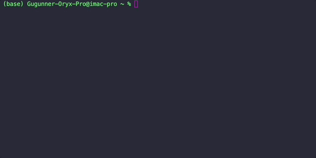
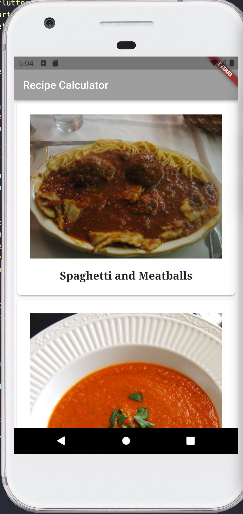
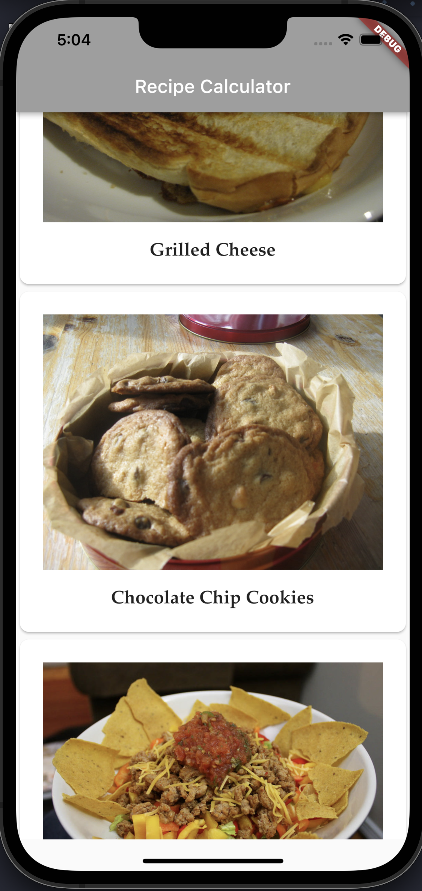

# Flutter Learning Path 

This repo is an example of the work the students, the repo reflects the learning path and work I did when attending Ray Wendelich Flutter Accelerator Bootcamp.

## **Week 1 Homework**
___

## Assignment 2
### My Name
Raul Alonzo 

### My Discord Username
RaulAlonzo#2563

### Where I'm at
Mexico City, MX

### What is my programming experience
#### Languages I've worked on
* Javascript 4 years
* Python 18 months
* Dart 8 months
* Java 12 months

#### A bit of my background
I've worked in different projects from web development, web service development to even some data analytics, using React, Spring, Node JS 8 and Jupyter Notebooks (Pandas FTW!). My biggest challenge wast to create a web scrapper using *Scrapy* to acquire data from many different retail online stores for a project where I was deeply involved [Kiwiik](https://kiwiikdata.com). 

Right now I'm working in an app that is operating in Mexico to allow people with financial challenges and variable incomes the opportunity of acquiring insurance and assistance services for them and their families at a low cost. The app is all made with Flutter [Piix](https://apps.apple.com/mx/app/piix/id1548514767?l=en).

### Things I love, like and enjoy doing 
* I love reading books focused in management, psychology and business, this year I read "The Toyota Way", "Never Split the Difference", "Dart Apprentice" and "Ego is the enemy". 
* I enjoy going for a run in the early morning. 
* I'm a huge fan of board games and card games, basically where there is strategy I like to go for a dive in it, just played "Everdell" and "Spirit Island" those game rock!. 
* I also enjoy going out to eat and learn about new places with delicious food. Most of all I enjoy studying and build or rebuild skills to enter bigger challenges.

### What I want to achieve
1. Graduate from the course (since I own a smalls startup being able to graduate from this course is for me a great leap forward)

2. Improve on my developing skills to better understand a software line of production for mobile apps.

3.  Get out of my comfort zone and challenge myself to do new things, first time attending a course not based in my country.

4. Enjoy the ride, even if I struggle in the course or if life has other plans I want to try new things.

## Assignment 3

Running... 
```
flutter doctor
```



## Assignment 4

### *Google Pixel and iPhone 13 Max Pro Screenshot of Recipes App*
___
<br>
 
&nbsp;
&nbsp;
&nbsp;
&nbsp;
&nbsp;
&nbsp;
&nbsp;
&nbsp;
&nbsp;
&nbsp;


