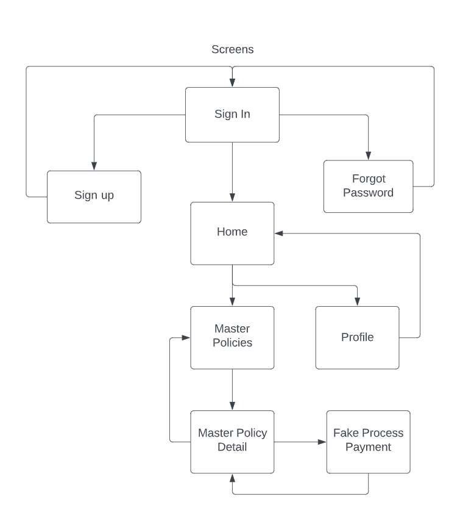

# Project Capstone Building a Tech Demo of Flutter

This is a project capstone as a tech demo developed during Raywenderlichs Flutter Accelerator Camp 2022.
___
### How to read this project.

The main README file is all about understanding the scope and the "why" of the tech demo, here you'll find information about what problem is the
tech demo trying to solve and how it addresses the problem. You'll also find information on the app architecture and main packages used. 

For detailed information on implementation the README updates each developing stage in a diferent .md file for reference, the decision to work the document in this fashion was made because the capstone project needs to be worked during the weeks of the bootcamp and each week some challenges arise to continue developing. The idea is to make clear on how each problem was tackled and the way it was solved, this includes code snippets and gifs of app behavior for reference on what is accomplished.

This document and demo in any way or form is trying to convey how a Flutter app should be developed but more as a reference point on how the demo uses different tools and techniques to obtain a final result, please enjoy and feel free to contact me with any detail on inquiry at ram2489@gmail.com. 
___
### Why do it?

More than 35 million inhabitants of LATAM are constantly moving to other countries in search of better opportunities, but many times they leave behind family members. Sadly sometimes disasters occur and there is no backup plan.

### What it is trying to solve?
An app that allows low to median-income households to obtain property and life insurance with flexible micropayments as either full attractive insurance policies or a side saving scheme for unpredictable events.

### How does it work?
It allows any person easy access to acquire an insurance policy for her or another family member. The user can start by paying a minimum entrance fee and by using flexible micro payment options increase the sum insured. Each payment creates a new sub-policy and extends the insurance for a whole year. This allows people with variant income to secure what is important to them without locked complex payment agreements. 

___

## App Dependencies

The app uses the following packages (if more are added this document will be updated):

```
dependencies:
- flutter:
  - sdk: flutter
  - flutter_riverpod: ^2.0.0-dev.9 (State manager)
  - cupertino_icons: ^1.0.2 (By default if an iOS project)
  - firebase_core: ^1.22.0 (Allows using Firebase)
  - firebase_auth: ^3.8.0 (Auth)
  - cloud_firestore: ^3.4.7 (DB)
  - freezed_annotation: ^2.1.0 (Needed by Freezed)
  - json_annotation: ^4.6.0 (Needed by Freezed)

dev_dependencies:
  - flutter_test:
    - sdk: flutter
  - flutter_lints: ^2.0.0
  - build_runner: ^2.2.1 (Needed by Freezed and other packages)
  - freezed: ^2.1.0+1 (Build safe non mutable models)
  - json_serializable: ^6.3.2 (Allows parsing from/to json easily)
```

## App Screens

Due to the limited time to build the capstone project the scope of the app is also constrained, here are the screens that will be developed for the tech demo.

<br>
 

Each line arrow represents the navigation of the app some screens can return back while others can't.

## App Architecture and Structure

The app has a Feature-first approach for all the directories in root and inside each "feature" folder the sub directories are structured as data (containes repositories, apis and services); domain (contains providers and models); ui (contains widgets and screens) and finally utils (contains possible controllers and other files).

Here is an example of the directory

```
|-lib/
|--master_policy/
|---data/
|---repository/
|----abstract_repository.dart
|----real_repository.dart
|----fake_repository.dart
|---api/
|----master_policy_api.dart
|---domain/
|----model/
|-----master_policy_model.dart
|----provider
|-----master_policy_provider.dart
|---ui
|----widgets/
|-----master_policy_card.dart
|-----insurance_type.dart
|----master_policy_screen.dart
|---utils/
|----insurance_types.dart

```
Note that the app follows a repository pattern and MVVM pattern for the app, while some MVC implementations may occur, the main focus is to keep data flow going from Data, Domain, Application and finally Presentation and backwards in the same pattern.

### First deliverable

The first deliverable is focused on testing riverpod and connecting SIGN IN with MASTER POLICIES screens.

Check the progress in [WEEK 6](/capstone-project/accesible_insurance_capstone_project/WEEK6.md).

### Second deliverable 

The second deliverable is focused on integrating Firebase Authentication and Firestore, this includes a sign in with a predefined account and retrieving a mocked policy document with some basic fields.

Check the progress in [WEEK 7](/capstone-project/accesible_insurance_capstone_project/WEEK7.md).
