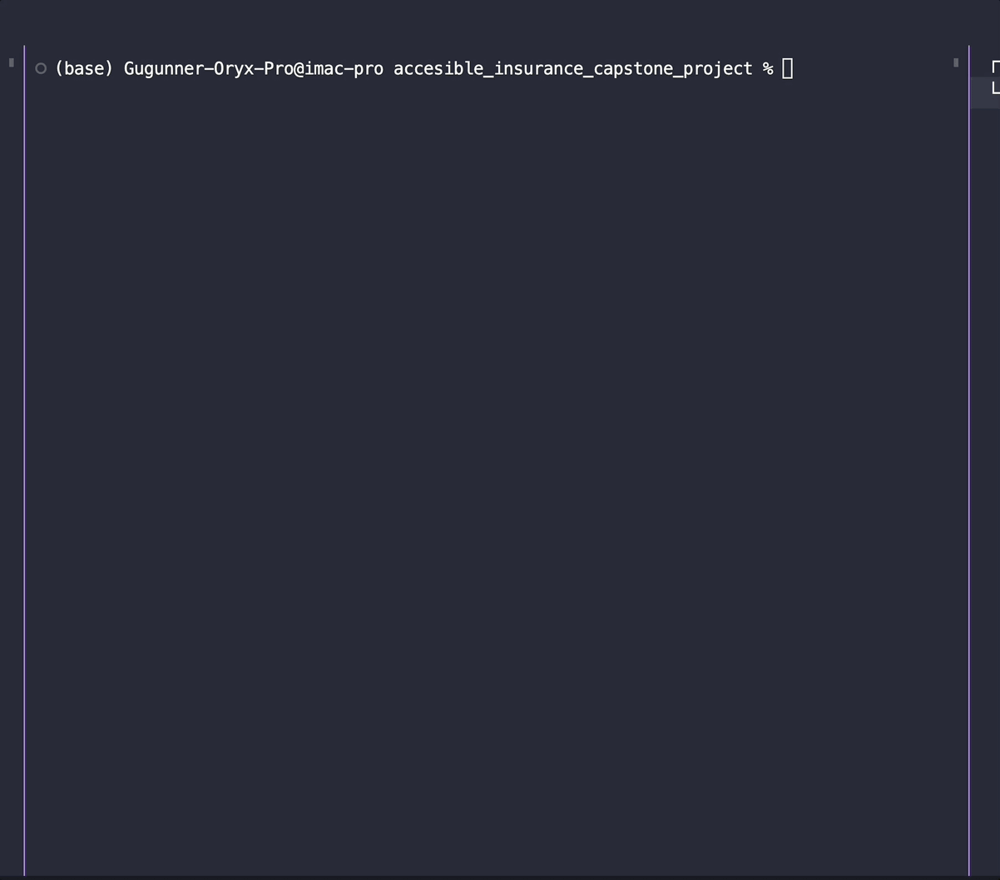
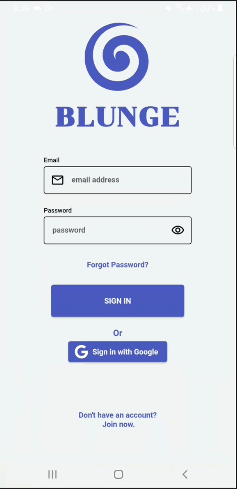
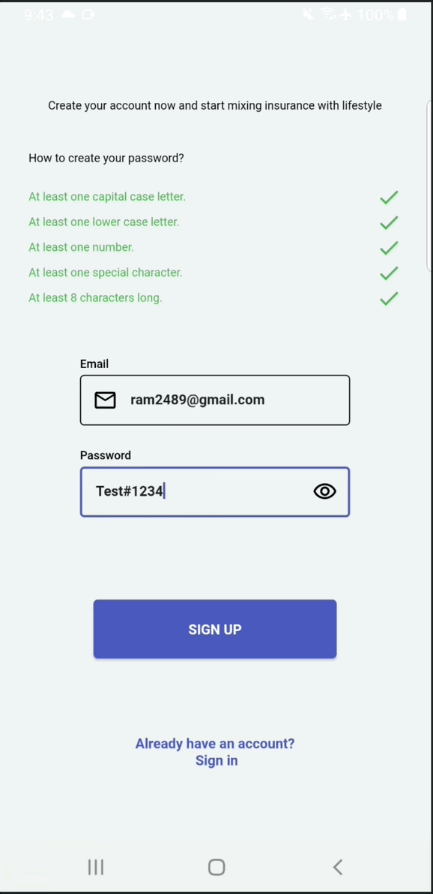
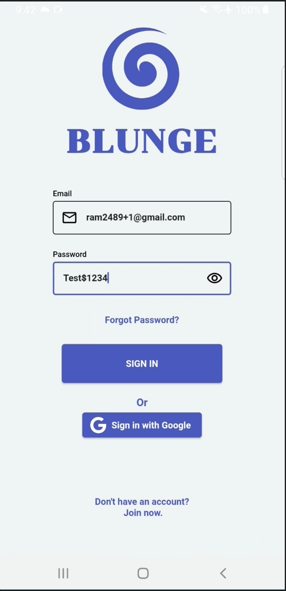
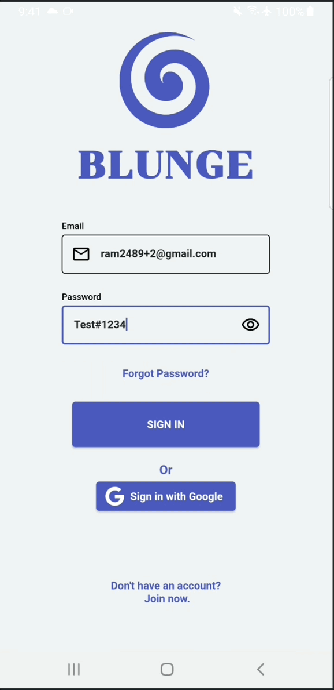
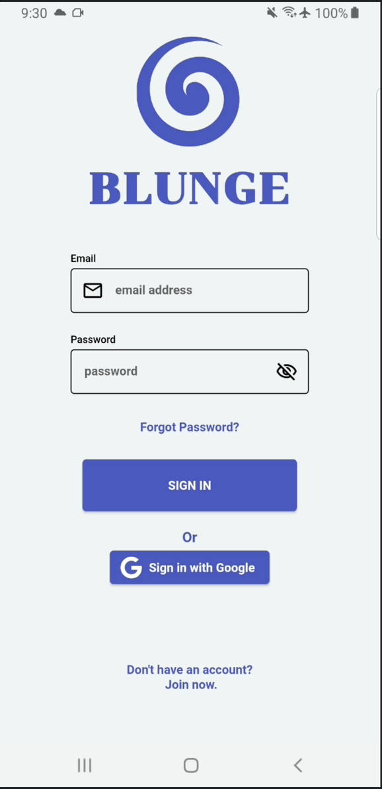
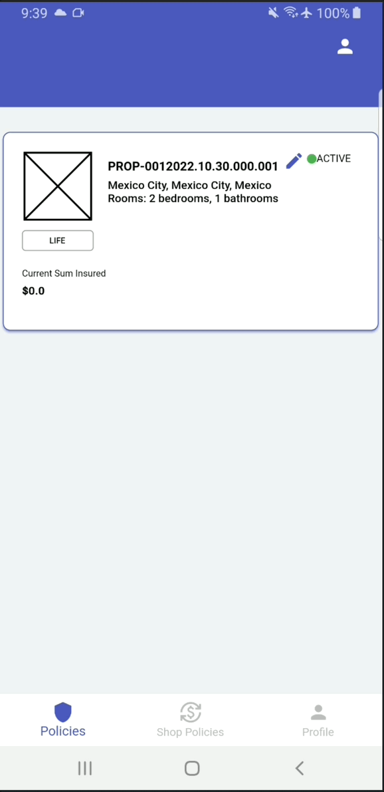

## **Week 11 Homework** 

## Assignment 1 

The app integrates Firebase so it can work with all the tools available for Firebase. To use Firebase with Flutter, Flutterfire Cli was installed and activated, the Firebase project was created and linked to through the Firebase Cli which created the corresponding google-service.json and GoogleService-Info.plist for Android and iOs respectively.


Here are some code snippets to the files created with Flutterfire after executing for both iOS and Android.

Autogenerated firebase_options.dart file
``` dart
static const FirebaseOptions android = FirebaseOptions(
    apiKey: '<ApiKey>',
    appId: '<AppId>',
    messagingSenderId: '517335428589',
    projectId: 'accesible-insurance',
    storageBucket: 'accesible-insurance.appspot.com',
  );

  static const FirebaseOptions ios = FirebaseOptions(
    apiKey: '<ApiKey>',
    appId: '<AppId>',
    messagingSenderId: '517335428589',
    projectId: 'accesible-insurance',
    storageBucket: 'accesible-insurance.appspot.com',
    iosClientId: '517335428589-pptdebl75ad60kqp02r8qn1t1vhlov75.apps.googleusercontent.com',
    iosBundleId: 'com.example.accesibleInsuranceCapstoneProject',
  );
```

iOS .plist file
```plist
<dict>
	<key>CLIENT_ID</key>
	<string>517335428589-pptdebl75ad60kqp02r8qn1t1vhlov75.apps.googleusercontent.com</string>
	<key>REVERSED_CLIENT_ID</key>
	<string>com.googleusercontent.apps.517335428589-pptdebl75ad60kqp02r8qn1t1vhlov75</string>
	<key>API_KEY</key>
	<string>API KEY</string>
	<key>GCM_SENDER_ID</key>
	<string>517335428589</string>
	<key>PLIST_VERSION</key>
	<string>1</string>
	...
	<true></true>
	<key>GOOGLE_APP_ID</key>
	<string>1:517335428589:ios:e091fa264af1845c51cbe4</string>
</dict>
```

Android .json file
```json
{
    "api_key": [
        {
          "current_key": "API KEY"
        }
      ],
    "services": {
    "appinvite_service": {
        "other_platform_oauth_client": [
        {
            "client_id": "517335428589-erdarp11uhe74gpe5ervinmuqajkcbv4.apps.googleusercontent.com",
            "client_type": 3
        },
        {
            "client_id": "517335428589-pptdebl75ad60kqp02r8qn1t1vhlov75.apps.googleusercontent.com",
            "client_type": 2,
            "ios_info": {
            "bundle_id": "com.example.accesibleInsuranceCapstoneProject"
            }
        }
        ]
    }
    }
}
```

And finally FirebaseInitialize in the project main.dart
```dart 
void main() async {
  ...
  await Firebase.initializeApp(
    options: DefaultFirebaseOptions.currentPlatform,
  );
  runApp(ProviderScope(observers: [Logger()], child: const MyApp()));
}
```

A simple ```flutterfire configure``` command execution.
<br>
 
<br>

___

## Assignment 2

The app uses Firebase Auth to sign up and sign in using email and password user credentials. It also uses custom message errors to alert the user when something went wrong with the sign in or the sign up process.

Sign up process that calls FirebaseAuth instance 
```dart
final signUpProvider =
      Provider.family<void, UserModel>((ref, userCredential) async {
    try {
      ///Signs up with the email and password using firebase 
      final user = await ref
          .read(AppProvider.instance.userProvider.notifier)
          .signUpWithEmail(
            email: userCredential.email,
            password: userCredential.password,
          );
      if (user != null) {
        ///If a User is returned from Firebase it resets the onboarding process
        ///and signs in with the user credentials
        await SharedPreferencesProvider.instance.setIsOnboarding(true);
        ref.read(AppProvider.instance.signInProvider(userCredential));
      }
    } on FirebaseAuthException catch (e) {
      ///If an error occurs and since the app know that any possible error
      ///comes from the firebase sign in call it maps the corresponding
      ///InputErrorState to be shown to te user.
      final inputProviderInstance = InputProvider.instance;
      if (e.code.contains('email-already-in-use')) {
        ref.read(inputProviderInstance.emailStateProvider.notifier).state =
            InputErrorState.emailInUse;
      } else if (e.code.contains('invalid-email')) {
        ref.read(inputProviderInstance.emailStateProvider.notifier).state =
            InputErrorState.invalidEmail;
      } else if (e.code.contains('operation-not-allowed')) {
        ref.read(inputProviderInstance.emailStateProvider.notifier).state =
            InputErrorState.notAllowed;
      } else if (e.code.contains('weak-password')) {
        ref.read(inputProviderInstance.emailStateProvider.notifier).state =
            InputErrorState.weakPassword;
      } else {
        ref.read(inputProviderInstance.emailStateProvider.notifier).state =
            InputErrorState.notAllowed;
      }
    }
  });
```

Sign in process that calls FirebaseAuth instance 
```dart
final signInProvider =
      Provider.family<void, UserModel>((ref, userCredentials) async {
    try {
      //Signs the user in with an email and password
      final user = await ref
          .watch(AppProvider.instance.userProvider.notifier)
          .signInWithEmail(userCredentials.email, userCredentials.password);
      //Changes the state of the sign in when the user signIn provider
      //changes state
      final signInState = ref.read(AppProvider.instance.signIn.state);
      final idToken = await user?.getIdToken();
      if (!signInState.state) {
        signInState.state = ref
            .watch(AppProvider.instance.signIn.notifier)
            .state = idToken != null;
      }
      //If the user is able to sign in, the route changes to "Home" ('/')
      if (signInState.state) {
        await SharedPreferencesProvider.instance.saveIdToken(idToken ?? '');
        await SharedPreferencesProvider.instance.setIsSignedIn(
          signInState.state,
        );

        //Initialize Sqlite database
        await DatabaseHelper.instance.database;
      }
    } on FirebaseAuthException catch (e) {
      ///If an error occurs and since the app know that any possible error
      ///comes from the firebase sign in call it maps the corresponding
      ///InputErrorState to be shown to te user.
      final inputProviderInstance = InputProvider.instance;
      if (e.code.contains('invalid-email')) {
        ref.read(inputProviderInstance.emailStateProvider.notifier).state =
            InputErrorState.invalidEmail;
      } else if (e.code.contains('user-not-found')) {
        ref.read(inputProviderInstance.emailStateProvider.notifier).state =
            InputErrorState.userNotFound;
      } else if (e.code.contains('wrong-password')) {
        ref.read(inputProviderInstance.emailStateProvider.notifier).state =
            InputErrorState.wrongCredentials;
        ref.read(inputProviderInstance.passwordStateProvider.notifier).state =
            InputErrorState.wrongCredentials;
      }
    }
  });
```
Google sign in 
```dart
final googleSignInProvider = Provider<void>((ref) async {
    try {
      final user = await ref
          .watch(AppProvider.instance.userProvider.notifier)
          .signInWithGoogle();
      final signInState = ref.read(AppProvider.instance.signIn.state);
      final idToken = await user?.getIdToken();
      if (!signInState.state) {
        signInState.state = ref
            .watch(AppProvider.instance.signIn.notifier)
            .state = idToken != null;
      }
      //If the user is able to sign in, the route changes to "Home" ('/')
      if (signInState.state) {
        await SharedPreferencesProvider.instance.saveIdToken(idToken ?? '');
        await SharedPreferencesProvider.instance.setIsSignedIn(
          signInState.state,
        );
        await SharedPreferencesProvider.instance.setIsOnboarding(true);
        //Initialize Sqlite database
        await DatabaseHelper.instance.database;
      }
    } on FirebaseAuthException catch (e) {
      debugPrint('Google Sign in error - ${e.code}');
    } catch (e) {
      debugPrint('Error');
    }
  });
```

To check the code it can be found in [app_provider.dart](/lib/universal_app/domain/provider/app_provider.dart)

Here are some examples of the possible results of the signup process

Successful signup
<br>
 
<br>

Error while signing up
<br>
 
<br>

Here are some examples of the possible results of the sign in process

---

Succesful sign in
<br>
 
<br>

Error while signing in
<br>
 
<br>
<br>
 
<br>
<br>
Google sign in
<br>
 
<br>
___

## Assignment 3

For the tech demo the app integrates Firebase cloudstore to manage the master polciies, for the purpose of the assignment each new user or each time you sign in with Google Sign in a new Master Policy is created, also the master policy can be read as a stream which makes it so everytime a master policy is updated the new result is watched and retrieved.

The app uses AppFirestoreService custom class that handles generic management of documents but a specific Provider to manage master policy logic such as what is read and what is updated.

AppFirestoreService custom class snippet method setDocument
``` dart
///A document can be set or updated with this method using [merge].
///
///Use either a [path] or [fromDocRef] but not both to manage
///where the document is set.
Future<void> setDocument({
    String? path,
    required Map<String, dynamic> document,
    bool merge = false,
    DocumentReference? fromDocRef,
  }) async {
    if (fromDocRef != null) {
      await fromDocRef.set(document, SetOptions(merge: merge));
    } else if (path.isNotNullOrEmpty) {
      final docRef = FirebaseFirestore.instance.doc(path!);
      await docRef.set(document, SetOptions(merge: merge));
    }
  }
```
To check the code it can be found in [app_firestore_service.dart](/lib/universal_app/data/service/app_firestore_service.dart)


```dart
    ///Creates a master policy following the specified document ref
    ///Creates a ref so if the path is not created it creates it first.
    Future<void> setMasterPolicyDocument(MasterPolicyModel masterPolicy) {
        final docRef = FirebaseFirestore.instance
            .collection('users')
            .doc(uid)
            .collection('master-policies')
            .doc();
        return firestoreService.setDocument(
        document: masterPolicy.toFirestore(),
        fromDocRef: docRef,
        );
    }

  ///Updates a document by merging new content with old content, uses a
  ///specific path, if the path is not there, it will throw an error.
  Future<void> updateMasterPolicyDocument(MasterPolicyModel masterPolicy) {
    if (masterPolicy.documentId.isNotNullOrEmpty) {
      final documentPath =
          FireStorePaths.mastePolicy(uid, masterPolicy.documentId!);
      return firestoreService.setDocument(
          document: masterPolicy.toFirestore(),
          path: documentPath,
          merge: true);
    }
    return Future.value();
  }
```

To check the code it can be found in [app_firestore_service.dart](/lib/universal_app/data/app_firebase_data_base.dart)

Here is the code working in the app for an update

<br>
 
<br>

## Assignment 4

To store some images of the user, the app uses Firebase Cloud Storage for example the user can select a user profile picture in the ProfileScreen to upload and then for the demo it uses a network streaming of the image to render it from Firebase Storage. A better use is to first encode it to base 64 and store the base 64 data to keep it lighter and faster to upload and stream or store in cache.

The complete change profile picture logic.

```dart
void _onChangeProfilePicture() async {
    //Gets the storage singleton instance reference
    final storageRef = FirebaseStorage.instance.ref();
    //Retrieves the firebase User
    final user =
        ref.read(AppProvider.instance.userProvider.notifier).auth.currentUser;
    //Launches the image picker to 
    final file = await ImagePicker().pickImage(source: ImageSource.gallery);
    //If a file is selected then it creates a reference that tries to 
    //store the files inside the user dir
    if (file != null) {
      final imagesRef =
          storageRef.child('images/${user?.uid ?? 'anonymous'}/profile_pic');
      try {
        ///Uploads the file with metadata to know it's type
        await imagesRef.putFile(
          File(file.path),
          SettableMetadata(
            contentType: 'image/jpg',
          ),
        );
        //If no error is thrown when uploading the image
        //it changaes the state of the image url to show the
        //streamed image.
        await setImgUrl();
      } on FirebaseException catch (e) {
        debugPrint('Could not upload image');
      }
    }
  }
```

To check the code it can be found in [profile_screen.dart](/lib/profile/ui/profile_screen.dart)

Changing the profile pic
<br>
 
<br>