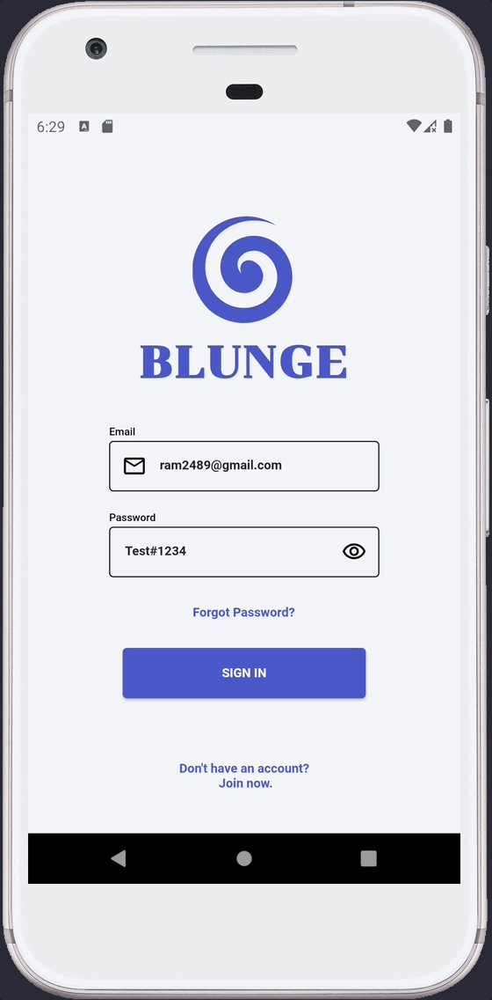
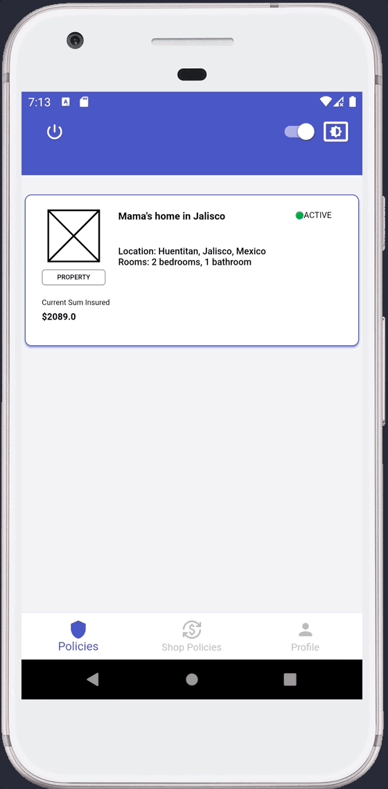
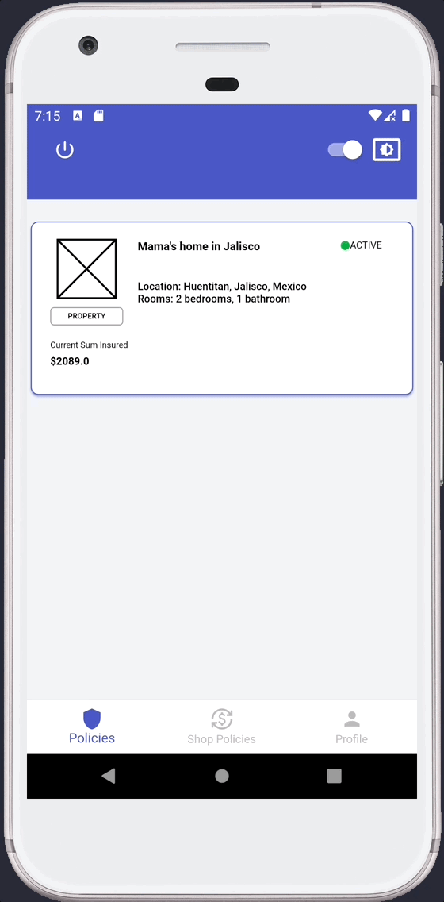
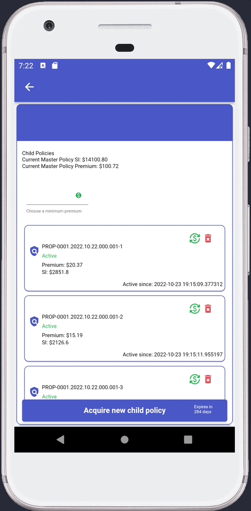
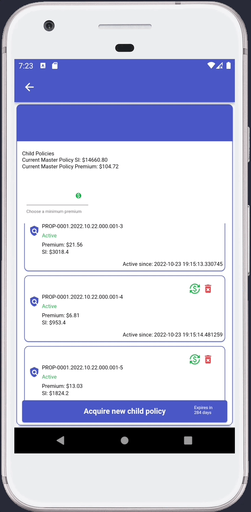
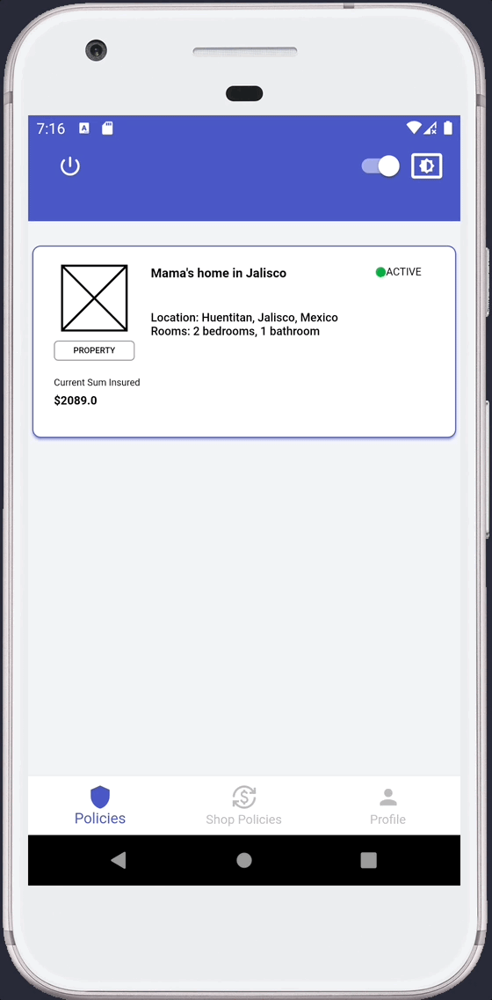
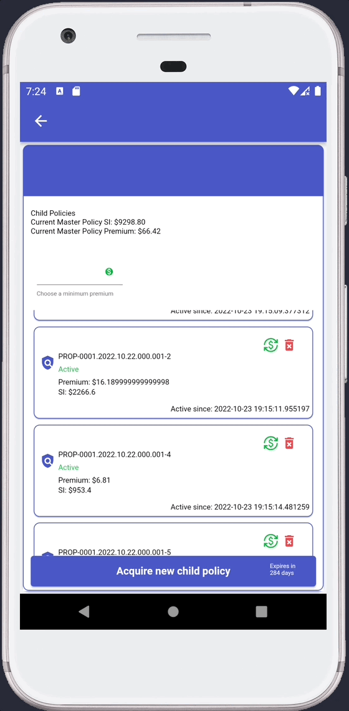

## **Week 10 Homework** 


## Assignment 1

The app is able to save the current theme selected by the user, currently the app has two themes to choose from Dark and Light mode. The app stores the ThemeMode index so the next time it opens up it checks if the SharedPreferences has an indes stored inside the key themeKey if no index is stored it always returns Light mode.

Here is the restore and set of the app Theme mode.

```dart
 ///Switches between light and dark mode and saves the state
  ///in SharedPreferences
  void _handleChange(bool state, WidgetRef ref) async {
    final theme = state ? ThemeMode.light : ThemeMode.dark;
    ref.read(appProviderInstance.themeProvider.notifier).state = theme;
    await SharedPreferencesProvider.instance.setTheme(theme);
  }
```

The code can be found in [theme_mode_switch.dart](/lib/profile/ui/widgets/theme_mode_switch.dart)

## Assignment 2

The app needs to show the onboarding to each new user or any user that has just installed the app a new device, but once the user opens the app again or signs out and later signs in again, the user does not need to see the onboarding again, to do this the app stores a simple boolean true or false state that persists each time the user opens up the app again. The app checks if the user should go to the onboarding screen or not once the logo animation ends.

Here is the restore and set of the app onboarding.

The code can be found in [animated_sign_in_logo.dart](/lib/sign_in/ui/widgets/animated_sign_in_logo.dart)
```dart
onEnd: () {
    controller.repeat();
    //Once the widget is has completed its animation the 
    //text 'Let's start!' or 'Welcome back!' is shown
    setState(() {
        opacity = 1;
    });
    //Gives enough time for the user to see the whole animation
    //before changing the route to show the onboarding or to
    //redirect to home path ('/')
    Future.delayed(Duration(seconds: delaySignIn), () {
        var route = '';
        controller.stop();
        if (isOnboarding) {
        route = AppRoutes.onboarding.route;
        } else {
        route = AppRoutes.home.route;
        }
        ref.read(routeProvider.notifier).state = route;
    });
}
```


Here is the Gif to the first time the Onboarding appears

<br>
 
<br>
<br>
Here is the Gif to the Theme and Onboarding persistence

<br>
 

___

## Assignment 3

The app uses a local database using SQLite and SQLBrite to manage the creation and queries of the internal SQL database.

### Assignment 3.1 

It inserts a new child policy that as part of the tech demo adds random data for both the premiumPaid and sumInsured property. The app follows a data flow that goes, provider, viewmodel, repository and finally the database.

Here is the Gif that shows the insert of a child policy

<br>
 
<br>

Here are all the methods used inside a code snippet, each method belongs to a different class.

To check the code it can be found in [child_policy_utils.dart](/lib/child_policy/utils/child_policy_utils.dart)

```dart
///////////Widget implementation////////////////
//Creates a new Child Policy based on the premium paid and the sum insured
//calculated
void onCreateNewChildPolicy(WidgetRef ref, String masterPolicyId) {
  final randomPremiumPaid =
      double.parse((Random().nextDouble() * 20.99 + 3.99).toStringAsFixed(2));
  final randomSumInsured =
      double.parse((randomPremiumPaid * 140).toStringAsFixed(2));
  final nowDate = DateTime.now();
  final nextDate = nowDate.add(const Duration(days: 365));
  final childPolicy = ChildPolicyModel(
    masterPolicyId: masterPolicyId,
    premiumPaid: randomPremiumPaid,
    sumInsured: randomSumInsured,
    activeSinceDate: DateTime.now(),
    expirationDate: DateTime(nextDate.year, nextDate.month, nextDate.day),
  );
  ref.read(
      childPoliciesProviderInstance.childPolicyInsertProvider(childPolicy));
}

/////Provider implementation/////////////

final childPolicyInsertProvider = FutureProvider.autoDispose
      .family<int, ChildPolicyModel>((ref, childPolicy) async {
    final database =
        ref.read(databaseProviderInstance.childPolicyDatabaseProvider);
    try {
      final id = await database.insertChildPolicy(childPolicy);
      return id;
    } catch (e) {
      rethrow;
    }
  },
);

////ChildPolicyDataBaseRepository////////////
Future<int> insertChildPolicy(ChildPolicyModel childPolicy) {
    return Future(() {
      return dbHelper.insertChildPolicy(childPolicy);
    });
  }

/////DatabaseHelper///////////
Future<int> _insert(String table, Map<String, dynamic> row) async {
    final db = await DatabaseHelper.instance.streamDatabase;
    return db.insert(table, row);
  }

  Future<int> insertChildPolicy(ChildPolicyModel childPolicy) {
    return _insert(
      DatabaseHelper._childPolicyTable,
      childPolicy.toJson(),
    );
  }
```

### Assignment 3.2 

As part of the tech demo, a child policy can update its premium paid by one each time it clicks the upate icon. The app follows a data flow that goes, provider, viewmodel, repository and finally the database.

Here is the Gif that shows the update of a child policy's premium paid and sum insured.

<br>
 
<br>

Here are all the methods used inside a code snippet, each method belongs to a different class.

To check the code it can be found in [child_policy_utils.dart](/lib/child_policy/utils/child_policy_utils.dart)

```dart
///////////Widget implementation////////////////

//Shows a dialog to confirm the update of a child policy
Future<void> onUpdate(
  WidgetRef ref, {
  required BuildContext context,
  required ChildPolicyModel childPolicy,
}) async {
  final newPremiumPaid = childPolicy.premiumPaid + 1.00;
  final newSumInsured = double.parse((newPremiumPaid * 140).toStringAsFixed(2));
  final shouldUpdate = await showDialog(
    context: context,
    barrierDismissible: false,
    builder: (dialogContext) {
      return ...
    },
  );
  //Only calls the provider to update the child policy if the
  //user confirms
  if (shouldUpdate) {
    ref.read(
      childPoliciesProviderInstance.childPolicyUpdateProvider(
        childPolicy.copyWith(
          premiumPaid: newPremiumPaid,
          sumInsured: newSumInsured,
        ),
      ),
    );
  }
}

/////Provider implementation/////////////

final childPolicyUpdateProvider = FutureProvider.autoDispose
      .family<void, ChildPolicyModel>((ref, childPolicy) {
    final database =
        ref.read(databaseProviderInstance.childPolicyDatabaseProvider);
    try {
      database.updateChildPolicy(childPolicy);
    } catch (e) {
      rethrow;
    }
  });

////ChildPolicyDataBaseRepository////////////
Future<int> updateChildPolicy(ChildPolicyModel childPolicy) {
    return dbHelper.updateChildPolicy(childPolicy);
  }

/////DatabaseHelper///////////
Future<int> _update(
    String table,
    Map<String, dynamic> row,
    String columnId,
    int id,
  ) async {
    final db = await DatabaseHelper.instance.streamDatabase;
    return db.update(
      table,
      row,
      where: '$columnId = ?',
      whereArgs: [id],
    );
  }

  Future<int> updateChildPolicy(ChildPolicyModel childPolicy) async {
    return _update(
      DatabaseHelper._childPolicyTable,
      childPolicy.toJson(),
      DatabaseHelper._childPolicyId,
      childPolicy.childPolicyId!,
    );
  }
```
### Assignment 3.3

The user can delete a child policy by either swiping and dismissing it or by clicking the trash icon. The app follows a data flow that goes, provider, viewmodel, repository and finally the database.

Here is the Gif that shows the delete of a child policy by swiping left or clicking the trash icon.

<br>
 
<br>

Here are all the methods used inside a code snippet, each method belongs to a different class.

To check the code it can be found in [child_policy_utils.dart](/lib/child_policy/utils/child_policy_utils.dart)

```dart
///////////Widget implementation////////////////

//Creates a new Child Policy based on the premium paid and the sum insured
//calculated
//Shows a dialog to confirm the delete of a child policy
Future<bool> onDeleteChildPolicy(
  WidgetRef ref, {
  required BuildContext context,
  required ChildPolicyModel childPolicy,
}) async {
  final shouldDelete = await showDialog(
    context: context,
    barrierDismissible: false,
    builder: (dialogContext) {
      return ...
    },
  );
  //Only calls the provider to delete the child policy if the
  //dialog if the user confirms and there is an id.
  if (shouldDelete && childPolicy.childPolicyId != null) {
    ref.read(childPoliciesProviderInstance
        .childPolicyDeleteProvider(childPolicy.childPolicyId!));
  }
  return shouldDelete;
}

/////Provider implementation/////////////

final childPolicyDeleteProvider =
      FutureProvider.autoDispose.family<void, int>((ref, id) {
    final database =
        ref.read(databaseProviderInstance.childPolicyDatabaseProvider);
    try {
      database.deleteChildPolicy(id);
    } catch (e) {
      rethrow;
    }
  });

////ChildPolicyDataBaseRepository////////////

Future<void> deleteChildPolicy(int id) {
    dbHelper.deleteChildPolicy(id);
    return Future.value();
  }

/////DatabaseHelper///////////
Future<int> _delete(String table, String columnId, int id) async {
    final db = await DatabaseHelper.instance.streamDatabase;
    return db.delete(
      table,
      where: '$columnId = ?',
      whereArgs: [id],
    );
  }

  Future<int> deleteChildPolicy(int id) {
    return _delete(
      DatabaseHelper._childPolicyTable,
      DatabaseHelper._childPolicyId,
      id,
    );
  }
```

### Assignment 3.4 and a Bonus (premium paid filter query)

Finally the app reads all child policies that are related to the selected master policy, the user can select the lower bound of premium paid so only child policies with premiumPaid equal or greater are returned. The app follows a data flow that goes, provider, viewmodel, repository and finally the database.

Here is the Gif that shows how it gets all child policies of the selected master policy.

<br>
 
<br>
<br>
Here is the Gif that shows how it gets all child policies of the selected master policy with the selected lower limit premium paid.

<br>
 
<br>

Here are all the methods used inside a code snippet, each method belongs to a different class.

To check the code it can be found in [child_policies_zone.dart](/lib/child_policy/ui/widgets/child_policies_zone.dart)

```dart
///////////Widget implementation////////////////
@override
  Widget build(BuildContext context, WidgetRef ref) {
    final childPolicies = ref.watch(childPoliciesProviderInstance
        .childPoliciesSelectStreamer(masterPolicyId));

    return Container(
      color: Colors.white,
      padding: EdgeInsets.fromLTRB(
        context.width * 0.025,
        context.height * 0.025,
        context.width * 0.025,
        0,
      ),
      child: childPolicies.when(
        data: (childPolicies) {
          var masterPolicySI = 0.00;
          var premiumPolicy = 0.00;
          if (childPolicies.isNotEmpty) {
            masterPolicySI = childPolicies
                .map((chp) => chp.sumInsured)
                .reduce((current, next) => current + next);
            premiumPolicy = childPolicies
                .map((chp) => chp.premiumPaid)
                .reduce((current, next) => current + next);
          }
          return ...
        },
        error: ((error, stackTrace) {
          return const Center(
            //TODO: Move text to English copies
            child: Text('No child policies found'),
          );
        }),
        loading: () => const Center(
          child: SizedBox(child: CircularProgressIndicator()),
        ),
      ),
    );
  }

/////Provider implementation/////////////

///A simple select that watches for any change in the minimumPremium
  ///if the minimumPremium is bigger than 0 it uses a filtered query to 
  ///retrieve only child policies that have a premiumPaid equal or greater
  ///than the minimumPremium.
  final childPoliciesSelectStreamer = StreamProvider.autoDispose
      .family<List<ChildPolicyModel>, String>((ref, masterPolicyId) {
    try {
      final database =
          ref.watch(databaseProviderInstance.childPolicyDatabaseProvider);
      final minimumPremium = ref
          .watch(ChildPoliciesProvider.instance.minimumPremiumPaid.state)
          .state;
      Stream<List<ChildPolicyModel>> childPolicies;
      if (minimumPremium > 0) {
        childPolicies = database
            .watchAllChildPoliciesByMasterPolicyIdAndPremiumPaidRange(
                masterPolicyId, minimumPremium)
            .asBroadcastStream();
      } else {
        childPolicies = database
            .watchAllChildPoliciesByMasterPolicyId(masterPolicyId)
            .asBroadcastStream();
      }
      return childPolicies;
    } catch (e) {
      rethrow;
    }
  });

////ChildPolicyDataBaseRepository////////////

Stream<List<ChildPolicyModel>> watchAllChildPoliciesByMasterPolicyId(
      String masterPolicyId) {
    return dbHelper.watchAllChildPoliciesByMasterPolicyId(masterPolicyId);
  }

  Stream<List<ChildPolicyModel>>
      watchAllChildPoliciesByMasterPolicyIdAndPremiumPaidRange(
          String masterPolicyId, [double minimumPremium = 0]) {
    return dbHelper.watchAllChildPoliciesByMasterPolicyIdAndPremiumPaidRange(
        masterPolicyId, minimumPremium).asBroadcastStream();
  }

/////DatabaseHelper///////////

Stream<List<ChildPolicyModel>> watchAllChildPoliciesByMasterPolicyId(
      String masterPolicyId) async* {
    final db = await DatabaseHelper.instance.streamDatabase;
    final childPolicies = db.createQuery(
      DatabaseHelper._childPolicyTable,
      where: '$_masterPolicyId = ?',
      whereArgs: [masterPolicyId],
    ).mapToList((row) => ChildPolicyModel.fromJson(row));

    yield* childPolicies;
  }

  Stream<List<ChildPolicyModel>>
      watchAllChildPoliciesByMasterPolicyIdAndPremiumPaidRange(
    String masterPolicyId, [
    double minPremium = 0,
    double maxPremium = 9999999,
  ]) async* {
    final db = await DatabaseHelper.instance.streamDatabase;
    final childPolicies = db.createQuery(
      DatabaseHelper._childPolicyTable,
      where: '$_masterPolicyId = ? '
          'AND premiumPaid >= ? '
          'AND premiumPaid <= ?',
      whereArgs: [masterPolicyId, minPremium, maxPremium],
    ).mapToList((row) => ChildPolicyModel.fromJson(row));
    yield* childPolicies.asBroadcastStream();
  }
```
