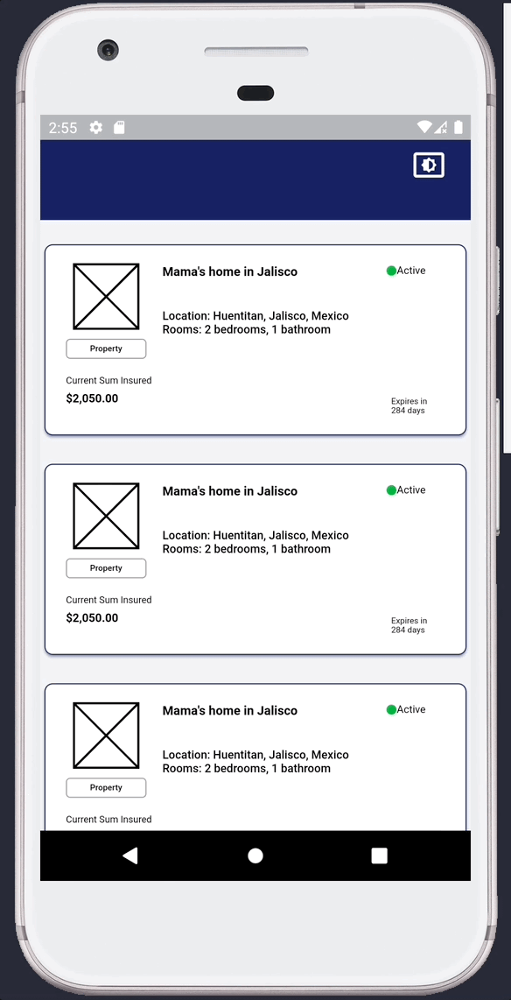
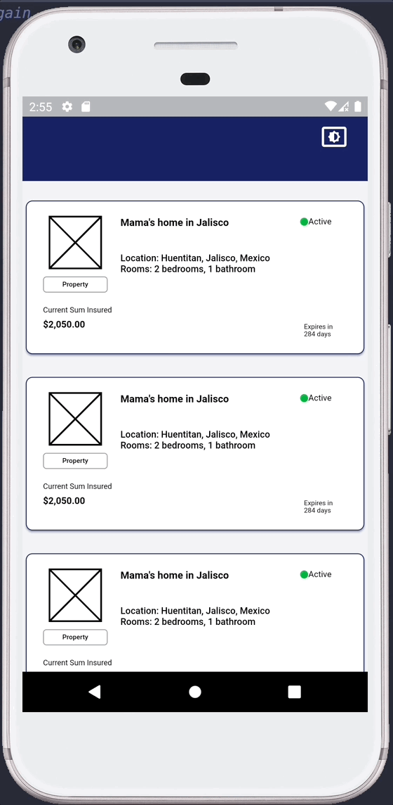
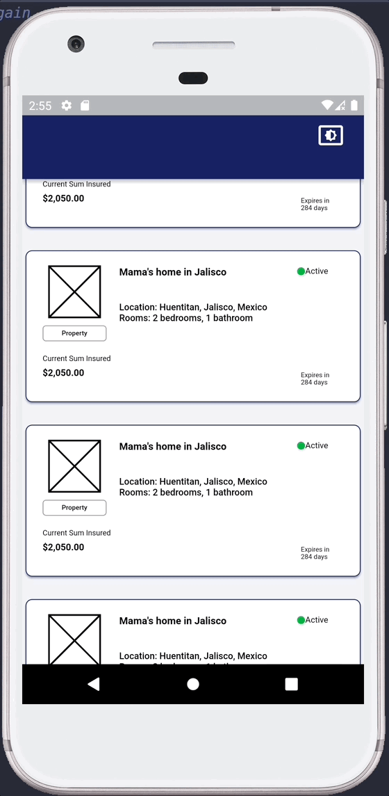
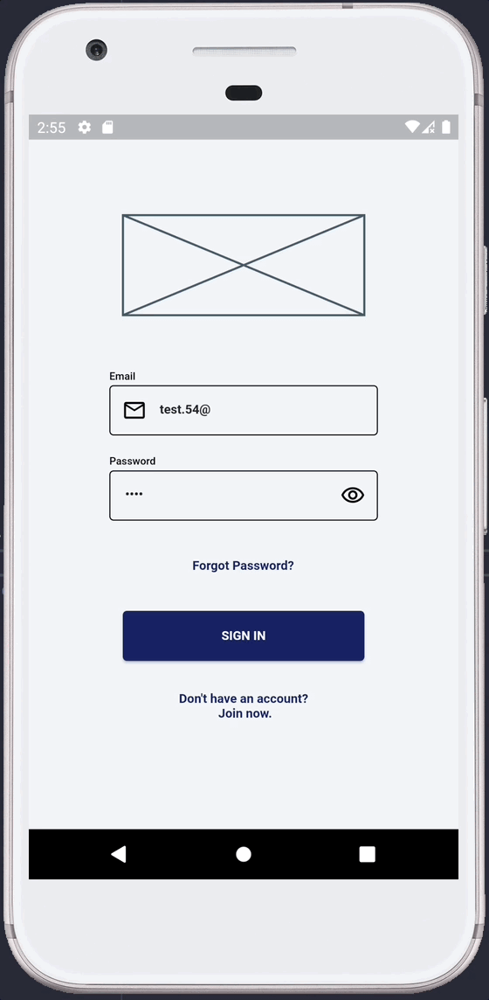

## **Week 6 Homework**

## Assignment 1 and 3

The basis for the reusable Card widget for the Master Policy was implemented, the idea is simple the Card expands to the complete height of the screen to show more information of the Master Policy once the user clicks on it. 

Here is the main implementation for the card and how it works.

The code can be found in [master_policy_card.dart](/capstone-project/accesible_insurance_capstone_project/lib/master_policy/ui/widgets/master_policy_card.dart) file.
```
//Widget Constructor
const MasterPolicyCard({
    Key? key,
    this.isScreen = false,
}) : super(key: key);

@override
  Widget build(BuildContext context) {
    return Card(
        ...
        Container(
            width: context.width,
            //Implementation to scale card when used as part of the screen
            height: context.height * (!isScreen ? 0.267 : 1),
        )
        ..
    );
}
```

Here is the Gif to show how it works

<br>
 

___

## Assignment 2 and 4

The app implements a SliverAppBar that scales and collapses when the user scrolls, the app bar follows the user while scrolling the list of master policies. The full implementation hasn't been finished.

Here is the code for the SliverAppBar implementation.

The code can be found in [master_policy_list_screen.dart](/capstone-project/accesible_insurance_capstone_project/lib/master_policies/ui/master_policy_list_screen.dart) file.
```
SliverAppBar(
    automaticallyImplyLeading: false,
    backgroundColor: loading ? Colors.transparent : null,
    toolbarHeight: context.height * 0.056,
    pinned: true,
    floating: true,
    expandedHeight: context.height * 0.112,
    collapsedHeight: context.height * 0.077,
    flexibleSpace: LoadingShaderShimmer(
    isLoading: loading,
    child: Container(
        ...
    ),
)
```
Here is the Gif to show how it works

<br>
 

___

## Assignment 5

The app has two modes for the ThemeData the first one in system or regular mode which also works as the light mode and another one that is dark mode, for the scope of the assigment there is a temporary IconButton in the SliverAppBar that changes the ThemeMode from system to dark and viceversa and also toggle the icon.


The code for the theme can be found in [theme.dart](/capstone-project/accesible_insurance_capstone_project/lib/universal_app/utils/theme/theme.dart) file.

The code for toggling the theme can be found in side the flexibleSpace property of the SliverAppBart in[master_policy_list_screen.dart](/capstone-project/accesible_insurance_capstone_project/lib/master_policies/ui/master_policy_list_screen.dart) file.

Here is the code for the Theme toggle implementation.

```
SliverAppBar(
    ...
    child: Container(
        ...
        child: Column(
        children: [
            //Begins theme toggle implementation
            Row(
            children: [
                const Expanded(child: SizedBox()),
                if (ref
                        .watch(appProvider.themeProvider.state)
                        .state ==
                    ThemeMode.light)
                IconButton(
                    onPressed: () {
                    ref
                        .read(
                            appProvider.themeProvider.notifier)
                        .state = ThemeMode.dark;
                    },
                    icon: const Icon(
                    AppIcons.ligthTheme,
                    size: 32,
                    ),
                ),
                if (ref
                        .watch(appProvider.themeProvider.state)
                        .state ==
                    ThemeMode.dark)
                IconButton(
                    onPressed: () {
                    ref
                        .read(
                            appProvider.themeProvider.notifier)
                        .state = ThemeMode.light;
                    },
                    icon: const Icon(
                    AppIcons.darkTheme,
                    size: 32,
                    ),
                ),
            ],
            )
        ],
        ),
    ),
  ),
)
```

Here is the Gif to show how it works

<br>
 

___

## Final notes 

The scope for this week was implementing Riverpod and connecting the SIGN IN and MASTER POLICIES LIST screen while completing all the homework assignments.

The project has the basic structure and the way Riverpod is handled through different screens is by using the singleton pattern to easily call any provider through the same instance.

Here is the example of the AppProvider class which calls the Riverpods providers.

```
class AppProvider {
  static final instance = AppProvider();

  final themeProvider =
      StateProvider<ThemeMode>((ref) => ThemeMode.light);

}
```

The full scope progress of the app for this week can be shown in the following gif.

There is also a shimmer implementation which can be found in the official Flutter cook book [Create a Shimmer Loading Effect](https://docs.flutter.dev/cookbook/effects/shimmer-loading).

<br>
 

___