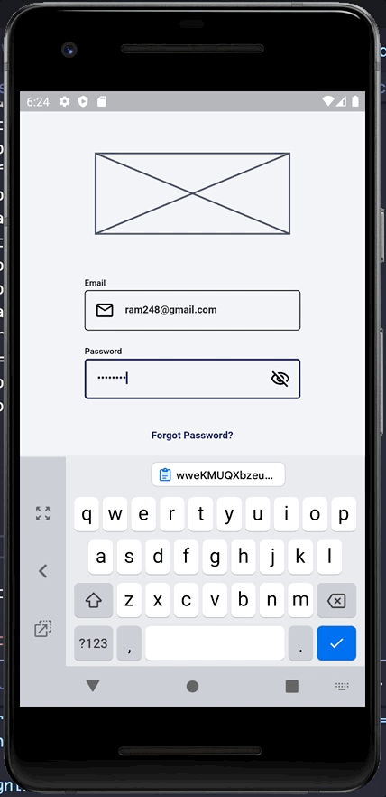

## **Week 7 Homework**

## Assignment 1

### Sign In 

The app implements MVVM for the sign in process, the way it behaves is that the user enters both the email and password which after clicking the sign in button checks for any input validation, if everything is accepted then it calls a riverpod provider that receives a *"UserModel"* that calls Firebase signInWithEmailAndPassword method. 

Here is the implementation of the onSignIn method and how it works.

The code can be found in [sign_in_screen.dart](/capstone-project/accesible_insurance_capstone_project/lib/sign_in/ui/sign_in_screen.dart)

```
//Calls everything needed to sign the user in
  void onSignIn({
    required WidgetRef ref,
  }) async {
    //Checks if the Form widget attached to this key is in the tree
    if (signInFormKey.currentState != null) {
      //Calls any onSave method of a FormField
      signInFormKey.currentState!.save();
      //Retrieves curren InpurErrorState for the email input
      final emailInputState =
          ref.read(inputProviderInstance.emailStateProvider.state).state;
      //Retrieves curren InpurErrorState for the password input
      final passwordInputState =
          ref.read(inputProviderInstance.passwordStateProvider.state).state;
      //Retrieves current email value for the email input
      final email = ref.read(inputProviderInstance.emailProvider.state).state;
      //Retrieves current password value for the password input
      final password =
          ref.read(inputProviderInstance.passwordProvider.state).state;
      //Disables working inputs to avoid the user from making any other interaction with the submit flag
      ref.read(inputProviderInstance.submitProvider.state).state = true;
      //Checks if there is no input validation error and the form can be validated
      if (passwordInputState == InputErrorState.idle &&
          emailInputState == InputErrorState.idle) {
        if (signInFormKey.currentState!.validate()) {
          //Calls the signInProvider with a family argument of UserModel
          ref.read(appProviderInstance
              .signInProvider(UserModel(password: password!, email: email!)));
        }
      }
    }
    //Releases the inputs so the user can continue interacting with the screen, only works
    //if the form could not be sent
    ref.read(inputProviderInstance.submitProvider.state).state = false;
  }
```

If a Firebase *"User"* and an auth token is retrieved then it changes the riverpod StateProvider with tha current Route and it changes to the new route by calling the goRouterProvider and it's redirect, otherwise the corresponding FirebaseAuthException code transforms into a user error for example user-not-found.

Here is the main implementation of the signInProvider and how it works.

The code can be found in [app_provider.dart](/capstone-project/accesible_insurance_capstone_project/lib/universal_app/domain/provider/app_provider.dart)

```
//Makes all changes to depending providers when the user signs in
  final signInProvider = Provider.family<void, UserModel>((ref, user) async {
    try {
      //Signs the user in with an email and password
      final userCredential = await ref
          .watch(AppProvider.instance.userProvider.notifier)
          .signInWithEmail(user.email, user.password);
      //Changes the state of the sign in when the user signIn provider
      //changes state
      final signIn = ref.watch(AppProvider.instance.signIn.notifier).state =
          userCredential?.user?.getIdToken() != null;
      //If the user is able to sign in, the route changes to "Home" ('/')
      if (signIn) {
        ref.read(routeProvider.notifier).state = AppRoutes.homeRoute;
      }
    } on FirebaseAuthException catch (e) {
      //If an error occurs and since the app know that any possible error
      //comes from the firebase sign in call it maps the corresponding InputErrorState
      //to be shown to te user.
      final inputProviderInstance = InputProvider.instance;
      if (e.code.contains('invalid-email')) {
        ref.read(inputProviderInstance.emailStateProvider.notifier).state =
            InputErrorState.invalidEmail;
      } else if (e.code.contains('user-not-found')) {
        ref.read(inputProviderInstance.emailStateProvider.notifier).state =
            InputErrorState.userNotFound;
      } else if (e.code.contains('wrong-password')) {
        ref.read(inputProviderInstance.emailStateProvider.notifier).state =
            InputErrorState.wrongCredentials;
        ref.read(inputProviderInstance.passwordStateProvider.notifier).state =
            InputErrorState.wrongCredentials;
      }
    }
  });
```

### Master Policy Retrieval

The app implements MVVM for the master policy retrieval, for this the app uses a "MasterPolicyModel" that has a factory method fromFirestore that converts a DocumentSnapshot into the model. All of this is happens as soon as the MasterPolicyListScreen Widget is build by calling the masterPolicyDbProvider which makes sure there is a valid user before implementing the whole procees of calling the FireBaseFirestore instance. 

Here is the implementation of the masterPolicyDbProvider collection method and how it works.

The code can be found in [database_provider.dart](/capstone-project/accesible_insurance_capstone_project/lib/universal_app/domain/provider/database_provider.dart)

```
///Returns a new instance of a [MasterPolicyDataBase] with
  ///the current userId and user the [AppFirestoreService] global
  ///instance.
  /// 
  final masterPolicyDbProvider =
      Provider.autoDispose<MasterPolicyDataBase?>((ref) {
    ///Checks for changes to the User in Firebase
    final user = ref.watch(appProviderInstance.authStateChangesProvider);
    ///Checks for any changes to the authorizationtoken of the user
    final token = ref.watch(appProviderInstance.authTokenProvider);
    final userValue = user.asData?.value;
    ///Checks if a user id and a token exists
    if (userValue != null) {
      if (userValue.uid.isNotEmpty) {
        final tokenValue = token.asData?.value;
        if (tokenValue != null && tokenValue.isNotEmpty) {
          //Returns a new instance of the [MasterPolicyDataBase]
          return MasterPolicyDataBase(
            uid: userValue.uid,
            firestoreService: AppFirestoreService.instance,
          );
        }
      }
    }
    return null;
  });
```

The master policies collection of the user is retrieved inside using the policiesStreamer which calls all the steps to get the user master policies by following the pattern /collection/document/collection in this case /users/$uid/master-policies.

Here is the implementation of policiesStreamer collection method and how it works.

The code can be found in [master_policies_provider.dart](/capstone-project/accesible_insurance_capstone_project/lib/master_policies/domain/provider/master_policies_provider.dart)

```
//Uses a stream to obtain the master policies collection
  final policiesStreamer =
      StreamProvider.autoDispose<List<MasterPolicyModel>>((ref) {
    //Retrieves the database
    final database = ref.watch(databaseProviderInstance.masterPolicyDbProvider);
    try {
      if (database != null) {
        //If there is a database the collection of master policies of the user is called
        final collection = database.masterPolicyCollection();
        return collection;
      }
      //If there is still no database the stream comes empty until a value changes
      return const Stream.empty();
    } catch (e) {
      //Any following error is forwarded
      rethrow;
    }
  });
```

Here is the Gif to show how everything works

<br>
 

## Additional comments

The *"AppFireStoreService"* is a universal implementation that will contain all generic implementations to call Firestore Database. 

Here is the implementation of the *"AppFireStoreService"* collection method and how it works.

The code can be found in [app_firestore_service.dart](/capstone-project/accesible_insurance_capstone_project/lib/universal_app/data/service/app_firestore_service.dart)

```
/// Returns a stream for a FirestoreCollection of Type.
  /// 
  /// Use the [snapshotBuilder] to pass a fromFirestore factory method
  /// from the model. For reference check the official documentation
  /// https://firebase.google.com/docs/firestore/query-data/get-data#custom_objects
  /// 
  /// A [queryBuilder] can be called by calling the [where] method of a 
  /// [CollectionReference] for example ```collectionRef.where('currentSI', isGreaterThan: 2000)```
  /// Since it is a closure the ref is obtained inside this method so there is no need
  /// to get the reference before.
  Stream<List<T>> collection<T>({
    required String collectionPath,
    required T Function(DocumentSnapshot<Map<String, dynamic>>? snapshot,
            SnapshotOptions? options)
        snapshotBuilder,
    CollectionReference<Map<String, dynamic>> Function(
            CollectionReference<Map<String, dynamic>>? query)?
        queryBuilder,
  }) {
    ///Obtains the [CollectionReference] with the query formed
    CollectionReference<Map<String, dynamic>> query =
        FirebaseFirestore.instance.collection(collectionPath);
    //If a [queryBuilder] is passed the new formed compound query is returned
    if (queryBuilder != null) {
      query = queryBuilder(query);
    }
    //Retrieves only documents inside the collection that exist
    final Stream<QuerySnapshot<Map<String, dynamic>>> snapshots =
        query.snapshots();
    return snapshots.map((snapshot) {
      return snapshot.docs
          .where((document) => document.exists)
          //Snapshot options are passed by default
          .map((document) => snapshotBuilder(document, SnapshotOptions()))
          .toList();
    });
  }
```

___

The implementation of Firebase and GoRouter using Riverpod are based on the repos by "bizz84" [Starter Architecture Flutter Firebase](https://github.com/bizz84/starter_architecture_flutter_firebase) and "Lucavenir" [GoRouter Riverpod](https://github.com/lucavenir/go_router_riverpod) respectively with adjustments for this project needs. Please support the original projects whenever possible and give them some love and support :heart: :rocket:.


