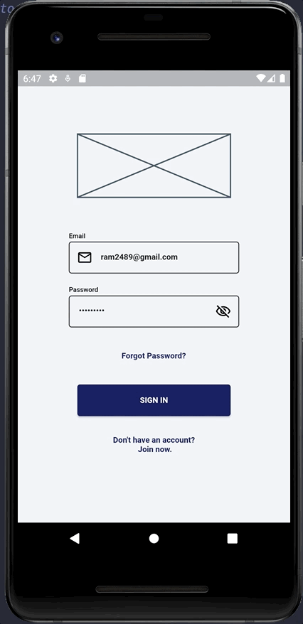
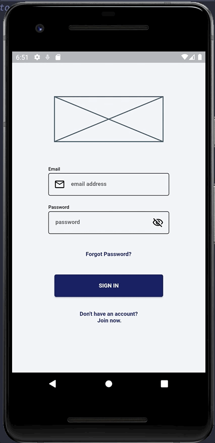
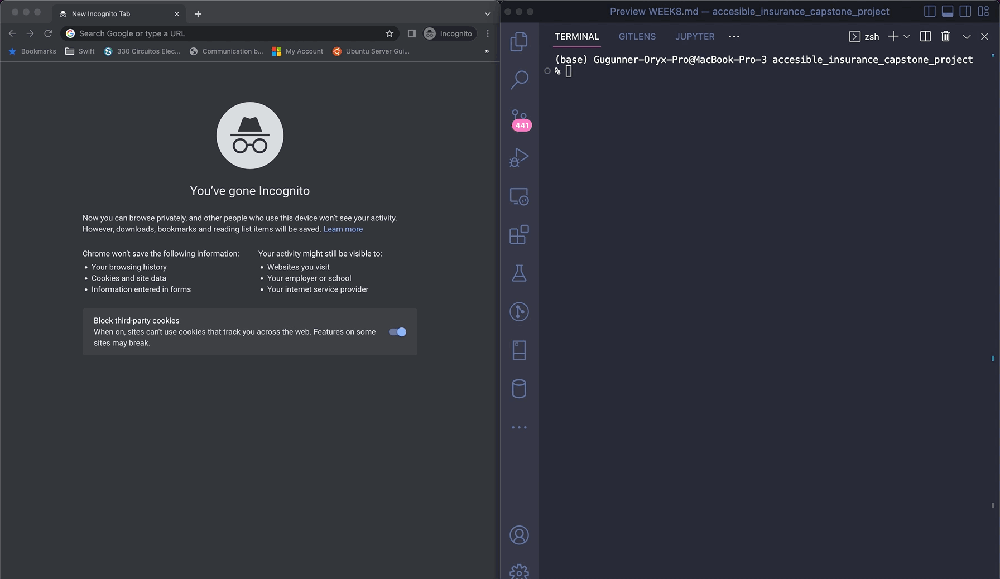

## **Week 8 Homework** 

## Assignment 1

The app uses GoRouter to handle declarative navigation where it applies redirection by listening to the change in the state of the route to know where to redirect to. For simplicity purposes the app does not handle redirection with a lot of conditional evalutations, instead by using provider a much more simple approach is achieved which greatly reduces the use of boolean logic that can quickly scale and create more boilerplate code.

Here is the AppRouter redirect method implementation and how it works.

The code can be found in [app_router.dart](/lib/universal_app/navigation/app_router.dart)

```dart
///Reads a [GoRouterState] and compares it to the [routeProvider] state.
  ///
  ///If it is the same it returns null.
  ///If it is different it returns the [stateRoute].
  ///Has a special launch condition where a specific route must be 
  ///provided [signin].
  Future<String?> redirect(BuildContext context, GoRouterState state) async {
    //Boolean value to know if user has already signed in 
    final signIn = ref.read(AppProvider.instance.signIn);
    //String value that returns current route to navigate to
    final stateRoute = ref.read(routeProvider.state).state;
    //Checks if location and stateRoute are the same to avoid infinite loops
    if (state.location == stateRoute) {
      return null;
    }
    //Redirects to [signin] route only if user ahs not signed in
    if (!signIn) {
      return AppRoutes.signin.route;
    }
    //Returns the route to navigate to
    return stateRoute;
  }
```

As part of the GoRouter implementation, the use of custom transitions was also explored and a CustomTransitions class was created for predefined transition animations. Depending whether or not the route needs a custom transition the property builder or pageBuilder is chosen for each GoRoute in the navigator routes.

Here is the routes implementation and how it works.

The code can be found in [app_router.dart](/lib/universal_app/navigation/app_router.dart)

```dart
//List of routes for the navigator 
  List<GoRoute> get routes => [
        GoRoute(
          name: AppRoutes.signin.name,
          path: AppRoutes.signin.route,
          //Use builder if default transition is used
          builder: (BuildContext context, GoRouterState state) {
            return const SignInScreen();
          },
        ),
        GoRoute(
          name: AppRoutes.onboarding.name,
          path: AppRoutes.onboarding.route,
          //Use pageBuilder when a custom transition is necessary
          pageBuilder: (BuildContext context, GoRouterState state) {
            return CustomTransitions.slideFromTo<void>(
              context: context,
              state: state,
              child: const OnboardingScreen(),
              duration: const Duration(milliseconds: 1500),
              begin: const Offset(0.0, -1.0),
              end: Offset.zero,
              curve: Curves.easeInOut,
            );
          },
        ),
        GoRoute(
          name: AppRoutes.home.name,
          path: AppRoutes.home.route,
          pageBuilder: (BuildContext context, GoRouterState state) {
            return CustomTransitions.scaleFromTo<void>(
              context: context,
              state: state,
              child: const MasterPolicyListScreen(),
              duration: const Duration(seconds: 1),
              curve: Curves.easeInOut,
            );
          },
        ),
      ];
```

Here is the Gif to show GoRouter navigation

<br>
 

___
## Assignment 2

Every app needs an onboarding for the first time a user sign in, this is the place where the basic information of the app and how it works is delivered to the user. The OnboardingScreen uses PageView with named constructor builder, to prevent any complex state management UI state management was decided to handle all the internal page navigation and selection of the page, this was also decided to keep the PageController in the widget and not in another file on the project. There are two ways to select a page, either by swiping right or left or by choosing one of the rounded shape navigator selectors.

Here a onboarding screen code snippet and how it works.

The code can be found in [onboarding_screen.dart](/lib/sign_in/ui/onboarding_screen.dart)


```dart 
@override
  Widget build(BuildContext context) {
    return Scaffold(
      body: PageView.builder(
        itemBuilder: (context, index) {
          return SafeArea(
            child: Stack(
              children: [
                Container(
                  height: context.height,
                  width: context.width,
                  color: Colors.white,
                  padding: EdgeInsets.fromLTRB(
                    context.width * 0.025,
                    context.height * 0.07,
                    context.width * 0.025,
                    context.height * 0.028,
                  ),
                  child: SizedBox(
                    height: context.height,
                    child: Column(
                      children: [
                        Expanded(
                          child: SizedBox(
                            width: context.width * 0.81,
                            height: context.height * 0.563,
                            child: const Placeholder(),
                          ),
                        ),
                        Container(
                          width: context.width * 0.75,
                          height: context.height * 0.063,
                          margin: EdgeInsets.symmetric(
                            vertical: context.height * 0.014,
                          ),
                          child: Row(
                            mainAxisAlignment: MainAxisAlignment.center,
                            children: pages.asMap().keys.map(
                              (key) {
                                final pageIndex = key;
                                return GestureDetector(
                                  onTap: () {
                                    //Updates the currentPage widget state
                                    _handleCurrentPageSelect(pageIndex);
                                    //Creates tha animation flow to move to the selected page
                                    pageController.animateToPage(
                                      currentPage,
                                      duration:
                                          const Duration(milliseconds: 400),
                                      curve: Curves.easeInOut,
                                    );
                                  },
                                  //Builds the navigator selector
                                  child: Container(
                                    margin: EdgeInsets.symmetric(
                                      horizontal: context.width * 0.014,
                                    ),
                                    width: context.height * 0.035,
                                    height: context.height * 0.035,
                                    decoration: BoxDecoration(
                                      shape: BoxShape.circle,
                                      //Changes the color of the navigator selector
                                      color: pageIndex == currentPage
                                          ? Theme.of(context).primaryColor
                                          : Theme.of(context)
                                              .primaryColor
                                              .withOpacity(0.6),
                                    ),
                                  ),
                                );
                              },
                            ).toList(),
                          ),
                        ),
                        SizedBox(
                          width: context.width * 0.9,
                          height: context.height * 0.101,
                          child: Text(
                            pages[index].description,
                            overflow: TextOverflow.fade,
                            style: Theme.of(context).textTheme.displayMedium,
                          ),
                        ),
                        //Builds the skip/finish button that navigates to Home ('/')
                        Container(
                          margin: EdgeInsets.only(
                            top: context.height * 0.028,
                          ),
                          width: context.width * 0.437,
                          height: context.height * 0.07,
                          child: ElevatedButton(
                            //Changes routeProvider and starts redirection to Home ('/')
                            onPressed: _handleEndOnboarding,
                            child: Text(
                              currentPage == pages.length - 1
                                  ? 'FINISH'
                                  : 'SKIP',
                              style: Theme.of(context)
                                  .textTheme
                                  .headlineMedium
                                  ?.copyWith(color: Colors.white),
                            ),
                          ),
                        )
                      ],
                    ),
                  ),
                ),
                //A simple close icon button that navigates to Home ('/')
                Align(
                  alignment: Alignment.topLeft,
                  child: IconButton(
                    padding: EdgeInsets.zero,
                    onPressed: _handleEndOnboarding,
                    icon: const Icon(
                      Icons.close,
                      color: Colors.red,
                    ),
                    iconSize: context.height * 0.042,
                  ),
                )
              ],
            ),
          );
        },
        itemCount: pages.length,
        controller: pageController,
        //Makes sure the navigator selector changes color by updating currentPage state when swiping left or right
        onPageChanged: _handleCurrentPageSelect,
      ),
    );
  }
```
To avoid any inconvenience to the user, a boolean value is stored inside SharedPreferences preferences so the user is not shown the onboarding flow again even if it signs out.

Here is the method that sets and stores the boolean value in SharedPreferences when user skips, closes or finishes the onboarding flow. 

The code can be found in [onboarding_screen.dart](/lib/sign_in/ui/onboarding_screen.dart)

```dart
  void _handleEndOnboarding() async {
    await SharedPreferencesProvider.instance.setIsOnboarding(false);
    ref.read(routeProvider.state).state = AppRoutes.home.route;
  }
```
Here is the Gif showing the onboarding

<br>
 

___
## Assignment 3 and 4

Unit testing and Widget testing where also explored in this project week progress, while the code coverage is not by any means complete, the basics of how to test individual screens or try integration testing was prapared as well as some initial work to test FirebaseAuth and FirebaseCloudStore.

To test individual screens a simple util method was created following the tutorial found here (Testing GoRouter in Flutter)[https://guillaume.bernos.dev/testing-go-router/]. 

The code can be found in [widget_tester.dart](/test/utils/extensions/widget_tester.dart)

Here is the code snippet to pump a screen for widget testing

```dart
///Pumps a Widget that is mapped to a GoRoute
  Future<void> pumpAppToRoute(
    String location,
    //TODO: Implement dynamic child call
    //Simple builder that returns the child
    Widget Function(Widget child) builder, {
    //Any overrides needed with Riverpod Providers such as FirebaseAuth
    List<Override>? overrides,
    //Any observers needed with Riverpod such as a Logger
    List<ProviderObserver>? observers,
  }) {
    return pumpWidget(ProviderScope(
      observers: observers ?? [],
      overrides: overrides ?? [],
      child: MaterialApp.router(
        title: 'Tech Demo Widget Testing',
        theme: AppTheme.theme,
        darkTheme: AppTheme.darkTheme,
        //router is a call to a GoRouter which has all the app routes
        routeInformationParser: router(location).routeInformationParser,
        routerDelegate: router(location).routerDelegate,
        routeInformationProvider: router(location).routeInformationProvider,
      ),
    ));
  }
```

Firebase authentication was tested using the packages firebase_auth_mocks and google_sign_in_mocks, to mock the full FirebaseAuth methods and implementations. As part of the unit tests the AppUser model with FirebaseAuth dependency injection was used.

The code can be found in [app_user_test.dart](/test/signin_feature/app_user_test.dart)

```dart
group('sign in unit tests', () {
    test(
        'should return uid and idToken when authenticated user is authenticated by email',
        () async {
      final auth = MockFirebaseAuth(
        mockUser: mockUser,
      );
      //Inject MockFirebaseAuth which extends from FirebaseAuth
      final appUser = AppUser(auth: auth);
      //Uses real app method to sign in
      final userCredential = await appUser.signInWithEmail(
        fakeEmail,
        fakePassword,
      );
      expect(userCredential, isNotNull);
      expect(userCredential!.user, isNotNull);
      expect(userCredential.user!.uid, 'rquNKEPunYhcsK0o59SHuECM3al3');
      //Uses fake implementation of getIdToken
      expect(await userCredential.user!.getIdToken(), isNotEmpty);
    });
  });
```
___

## Additional comments

A bashscript file was created to automatically run the Flutter test coverage report after running all tests. An executable bashscript file was created. If using a Mac don't forget to install lcove from brew.

Here is the Gif running the executable file

<br>
 

___


