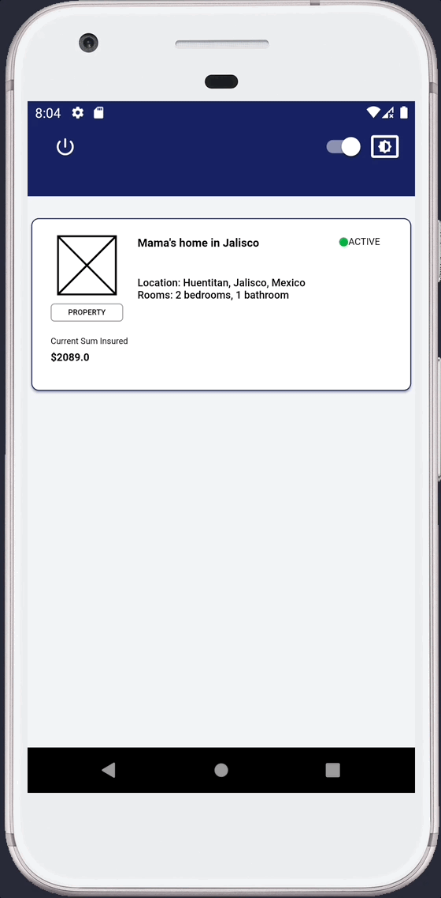
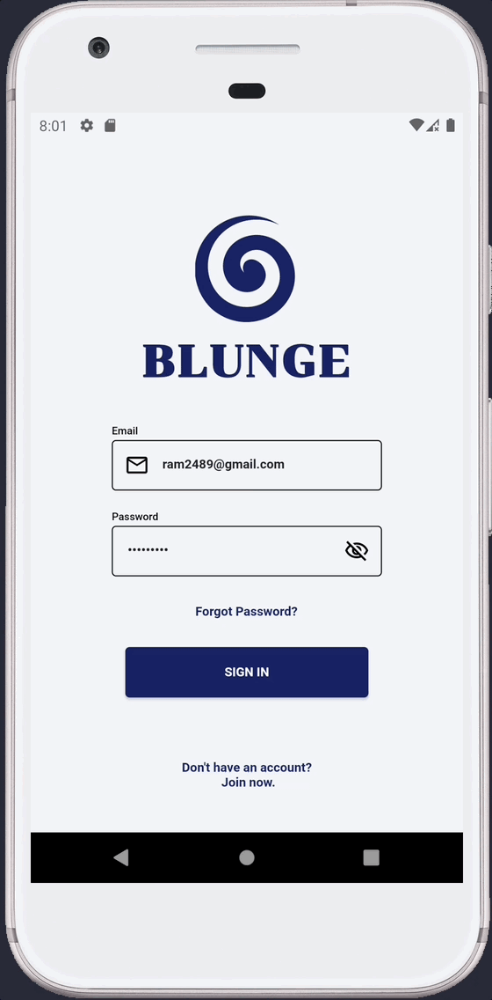
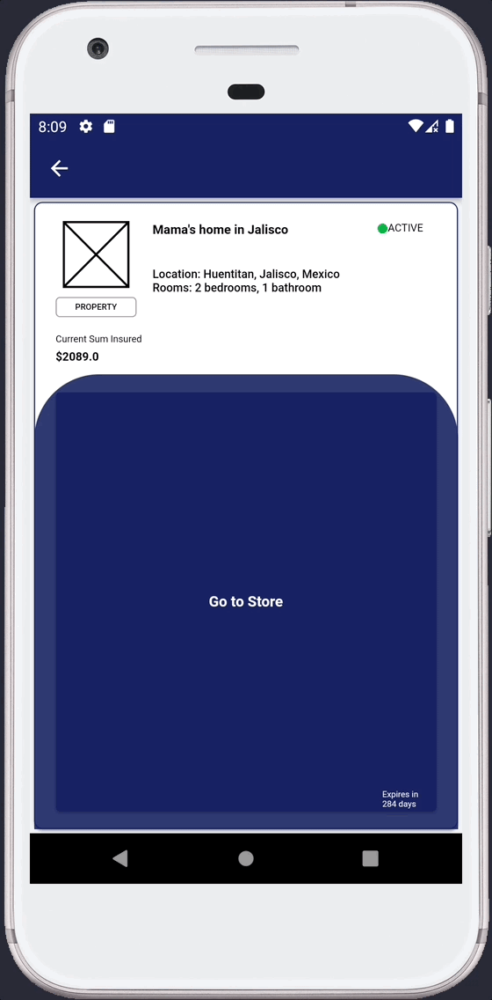

## **Week 9 Homework** 

## Assignment 1

To make the app look more appealing implicit animations were added when the user selects one of the master policies which first opens the selected card with a hero animation and pops a container that takes some space of the expanded card by using AnimatedAlign, AnimatedOpacity and AnimatedContainer to keep the animation centered while appearing and when resizing.

<br>
 

Here is the AnimatedChildPolicyZone and a code snippet of how it works.

```dart
void animateIt() {
    //Once the widget has been built the first time a timer starts
    //to change width, height and opacity. The timer is to
    //prevent any animation from ocurring while the Hero animation finishes
    //due to the layer building while transitioning. 
    Future.delayed(const Duration(milliseconds: 180), () {
      if (mounted) {
        setState(() {
          width = context.width * 0.2;
          height = context.width * 0.2;
          opacity = 1;
        });
      }
    })
    //After the initial values are set, the widget starts
    //to change size and create a radius to look as a rounded shape
    .then((_) {
      if (mounted) {
        setState(() {
          width = context.width;
          height = context.width * 1.05;
          topRadius = context.width * 0.15;
          bottomRadius = 0;
        });
      }
    });
  }

  @override
  Widget build(BuildContext context) {
    //Uses animated align since it is wrapped by a Stack widget
    //The animation is created by stacking several AnimatedImplicitWidgets
    return AnimatedAlign(
      duration: const Duration(seconds: 0),
      alignment: Alignment.bottomCenter,
      curve: Curves.easeInOutSine,
      child: AnimatedOpacity(
        opacity: opacity,
        duration: opacityDuration,
        curve: Curves.easeInOutExpo,
        child: AnimatedContainer(
          width: width,
          height: height,
          duration: containerDuration,
          padding: EdgeInsets.symmetric(
            vertical: context.height * 0.025,
            horizontal: context.width * 0.05,
          ),
          decoration: BoxDecoration(
            borderRadius: BorderRadius.vertical(
              top: Radius.circular(topRadius),
              bottom: Radius.circular(bottomRadius),
            ),
            color: Theme.of(context).primaryColor.withOpacity(0.9),
          ),
          onEnd: () {
            debugPrint('End');
          },
          curve: Curves.elasticOut,
          child: ChildPolicyZoneContent(
            index: widget.index,
          ),
        ),
      ),
    );
  }
```

The code can be found in [animated_child_policy_zone.dart](/lib/master_policy/ui/widgets/animated_child_policy_zone.dart)

___

## Assignment 2

A more complex animation was created for the user to help the app logo relate with the user by giving it an animation as soon as the user signs in for the first time or any subsequent time. This animation uses both implicit and explicit animations to create the effect. The implicit animation is created to move the logo around and the explicit animation is used to keep a rotation of the logo while a certain condition is met. Finally an AnimatedOpacity widget is used to show the small initial text the user reads while waiting the onboarding process.

<br>
 

Here is the AnimatedSignInLogo and a code snippet of how it works.

```dart
@override
  void initState() {
    //An initial animation controller is set that will be used for
    //the rotation of the widget.
    controller = AnimationController(
      duration: Duration(milliseconds: rotationCycle),
      vsync: this,
    );
    //An animation is set with the controller which handles the
    //the ticker (frame per second) is assigned to control any state 
    //changes.
    animation = CurvedAnimation(
      parent: controller,
      curve: Curves.linear,
    );
    //Simple delay timer so the logo starts at top position
    //before starting to move.
    WidgetsBinding.instance.addPostFrameCallback((_) {
      Future.delayed(
          Duration(
            milliseconds: delayMoveCycle,
          ), () {
        setState(() {
          top = context.height * 0.425;
        });
      });
    });
    super.initState();
  }

  @override
  void dispose() {
    controller.dispose();
    super.dispose();
  }

  @override
  Widget build(BuildContext context) {
    final isOnboarding = SharedPreferencesProvider.instance.isOnboarding();
    return AnimatedPositioned(
      left: context.width * 0.375,
      top: top ?? context.height * 0.1128,
      duration: Duration(
        milliseconds: moveCycle,
      ),
      onEnd: () {
        //Once the widget is completely moved it is shown
        setState(() {
          opacity = 1;
        });
        //Gives enough time for the user to see the whole animation
        //before changing the route to show the onboarding or to
        //redirect to home path ('/')
        Future.delayed(Duration(seconds: delaySignIn), () {
          var route = '';
          controller.stop();
          if (isOnboarding) {
            route = AppRoutes.onboarding.route;
          } else {
            route = AppRoutes.home.route;
          }
          ref.read(routeProvider.notifier).state = route;
        });
      },
      curve: Curves.fastOutSlowIn,
      child: Column(
        children: [
          //The rotation animation is used with an explicit animation
          RotationTransition(
            turns: animation,
            child: RotateTransition(
              animation: animation,
              child: const Imago(),
            ),
          ),
          //The text fades in after the logo starts rotating
          AnimatedOpacity(
            opacity: opacity,
            duration: Duration(
              milliseconds: opacityCycle,
            ),
            child: Container(
              margin: EdgeInsets.only(
                top: context.height * 0.028,
              ),
              child: Text(
                isOnboarding ? EnglishCopies.start : EnglishCopies.welcomeBack,
                style: Theme.of(context).textTheme.displayLarge!.copyWith(
                      color: Theme.of(context).primaryColor,
                    ),
                textAlign: TextAlign.center,
              ),
            ),
          )
        ],
      ),
    );
  }
```

The code can be found in [animated_sign_in_logo.dart](/lib/sign_in/ui/widgets/animated_sign_in_logo.dart)

## Assignment 3

As part of the learning curve for the animations an implementation that extends from the AnimatedWidget was used for the upgrade policy loader screen. In this case only explicit animations are used since the animation needs to go on until a certain condition is met and repeat first going forward and then in reverse. Multiple widgets were used for this animation which fade in and out and each moves to a different diagonal corner of the screen while the screen is loading.

<br>
 

Here is a single representation of one matrix point.

```dart
///An explicit animation is used that based
      ///on the container size starts from the middle
      ///and then moves to a different corner.
      PositionedTransition(
        rect: RelativeRectTween(
          begin: RelativeRect.fromSize(
            Rect.fromLTWH(
              context.width * 0.292,
              context.height * 0.375,
              context.height * 0.25,
              context.height * 0.25,
            ),
            MediaQuery.of(context).size,
          ),
          end: RelativeRect.fromSize(
            Rect.fromLTWH(
              -context.width * 0.1,
              0,
              context.height * 0.25,
              context.height * 0.25,
            ),
            MediaQuery.of(context).size,
          ),
        )
        //In this case tha Animation was set from inside the 
        //animate method call.
        .animate(
          CurvedAnimation(parent: controller, curve: Curves.ease),
        ),
        //A rotation animation is used and since the controller
        //has a repeat(reverse: true) it goes forward and backward
        child: RotationTransition(
          turns: CurvedAnimation(
            parent: controller,
            curve: Curves.linear,
          ),
          child: AnimatedLogoMatrixPoint(controller: controller),
        ),
      ),
```

The code can be found in [upgrade_policy_screen.dart](/lib/policy_store/ui/upgrade_policy_screen.dart)

