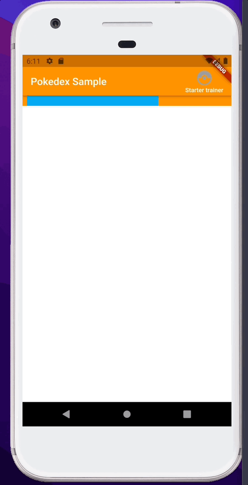
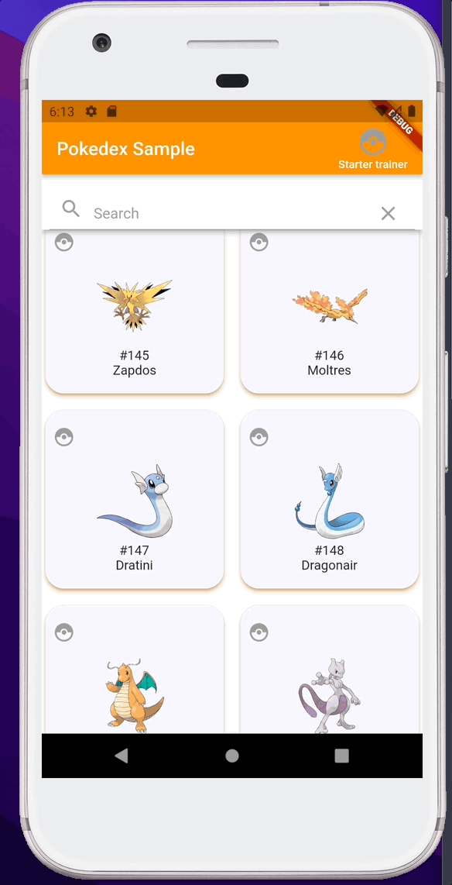
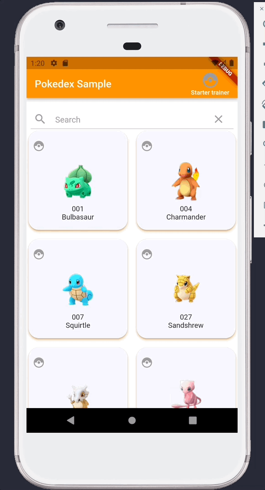
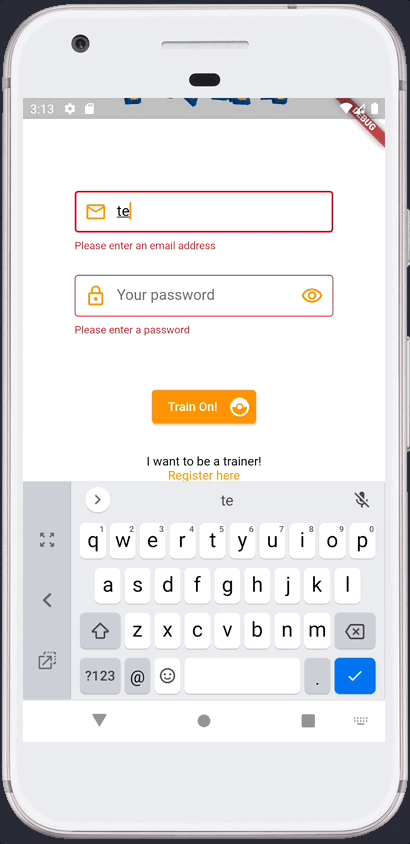
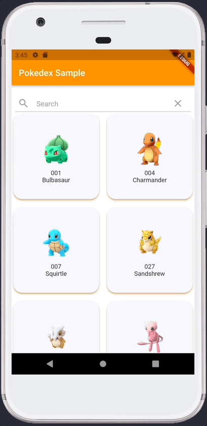

## **Week 5 Homework**

## Assignment 1, 2, 3

Infinite scrolling making paginated network calls
___
<br>
 

___

The functionality is based on an infinite scroll. It includes the repository pattern and the implementation of abstract classes such as PaginationRepository, which is injected as a dependency on the PokemonProvider and can easily be subsituted in test for a fake repository that implements the same abstract class.

Here is a code snippet of the Provider initialization which can be found [main.dart](lib/home.dart).

```
  Widget build(BuildContext context) {
    return MaterialApp(
      title: 'Pokedex Sample',
      home: MultiProvider(providers: [
        ChangeNotifierProvider(
            create: (ctx) => PokemonProvider(
                PokemonRepository(PokemonApi(api: AppDioApi(Dio()))))),
        ChangeNotifierProvider(create: (ctx) => PokemonCaptureProvider())
      ], child: const Home()),
    );
  }
``` 
The pokemon repository can be easily subsituted for a fake repository.

The api request was implemented using the repository pattern, here are some examples of the api class and the repository class. Note that **[Dio]** is used. 

Pokemon Api Snippet you can see the full code [pokemon_api.dart](lib/pokemon_detail_feature/data/api/pokemon_api.dart)
```
///Simple call that calls all pokemon without any pagination
  Future<T> getPokemonsApi<T>() async {
    try {
      ///Leave response so you can debug it in this point
      final response = await api.get(Endpoints.pokemonsUrl);
      return response;
    } catch (e) {
      rethrow;
    }
  }
```

Pokemon Repository Snippet you can see the full code [pokemon_repository.dart](lib/pokemon_detail_feature/data/repository/pokemon_repository.dart)
```
    try {
      final response = await pokemonApi.getPokemonsApi<Response>();
      final statusCode = response.statusCode ?? HttpStatus.internalServerError;
      if (statusCode == HttpStatus.ok) {
        if (response.data != null) {
          final data = jsonDecode(response.data);
          if (data is List) {
            //This is a demo to show pagination, pagination should be implemented as a web service
            return data.sublist(start, end);
          }
        }
      }
      throw Exception(
          'There is no status code, no data in response, or data is not of type list');
    } catch (e) {
      if (e is DioError) {
        final errorMessages = AppDioApiExceptions.fromDioError(e);
        throw errorMessages;
      }
      rethrow;
    }
```
## Assignment 4 and 5

Hero Animation and passing the pokemon object.

___
<br>
 

___

Hero animation was implemented using a PageRouteBuilder to make the first
transitio duration slower, data wass passed through the pokemon object and
the navigation is on the app internal router using Navigator.of(context).push() and Navigator.pop(context).

Here is the code snippet for the hero animation using the pokemon.num as the tag. You can see the full code [pokemon_card.dart](lib/pokemon_detail_feature/ui/widgets/pokemon_card.dart)

```
return GestureDetector(
      onTap: () {
        Navigator.of(context).push(PageRouteBuilder(
            transitionDuration: const Duration(milliseconds: 800),
            pageBuilder: (context2, animation1, animation2) {
              return Detail(pokemon: pokemon);
            }));
      },
      child: Hero(
        tag: pokemon.num,
        child: Card(
          color: Colors.white,
          shadowColor: Colors.orange,
          shape: const RoundedRectangleBorder(
            borderRadius: BorderRadius.all(Radius.circular(20.0)),
          ),
          elevation: 3.0,
          child: isWild
              ? WildPokemon(
                  pokemon: pokemon,
                  captureProvider: captureProvider,
                )
              : CapturedPokemon(pokemon: pokemon),
        ),
      ),
    );
```
To see how information is passed between widgets with Navigator.push() and Navigator.pop() check **Week 4 Homework - assignment 4**.

Here is the code snippet of how the pokemon is captured. To see the full code check [pokemon_capture_provider.dart](lib/pokemon_capture_feature/provider/pokemon_capture_provider.dart)

```
void updateCapture(PokemonModel pokemon) {
    pokemon.captured = !pokemon.captured;
  }
```

To see how the pokemon is released, here is the snippet code. To see the full code check [captured_pokemon_screen.dart](lib/pokemon_capture_feature/ui/captured_pokemon_screen.dart)
```
    Dismissible(
    key: ValueKey(capturedPokemon.num),
    direction: DismissDirection.horizontal,
    background: Container(...
    ),
    onDismissed: (direction) {
        captureProvider.updateCapture(capturedPokemon);
        captureProvider.updateCapturedPokemons(
            captureProvider.capturedPokemons);
        ScaffoldMessenger.of(context).showSnackBar(SnackBar(
            backgroundColor: Colors.orange,
            content: Text(
                'You have released ${capturedPokemon.name}!')));
    },
    child: PokemonCard(
        pokemon: capturedPokemon,
        captureProvider: captureProvider,
    ))
```


___

## **Week 4 Homework**

Favorite pokemons in the form of being captured. 
## Assignment 4
<br>
 


## **Week 3 Homework**
## Assignment 3-4
Login validation and search function with sliver app bar
___
<br>
 
&nbsp;
&nbsp;
&nbsp;
&nbsp;
&nbsp;
&nbsp;
&nbsp;
&nbsp;
&nbsp;
&nbsp;


___

## **Week 2 Homework**

## Assignment 5
The login page of the pokedex app


<br>
You can find the code here 

[Pokedex](https://github.com/Gugunner/rw-flutter-bootcamp/tree/raul/week-2/week-1/pokedex)

## **Week 1 Homework**
___
## Assignment 3

Running... 
```
flutter doctor
```


## Assignment 4

### *Google Pixel and iPhone 13 Max Pro Screenshot of Recipes App*
___
<br>
 
&nbsp;
&nbsp;
&nbsp;
&nbsp;
&nbsp;
&nbsp;
&nbsp;
&nbsp;
&nbsp;
&nbsp;


## Assignment 6 and Assignment 7

Here it is the Pokedex Sample proyect with some nice to haves.

* Some responsiveness for big and small screens
* Pokeball X,Y location is the same no matter the screen 
* Scrollable on small screens
* Some additional styles to make a more attractive visual experience
<br>
<br>

A 2.7 inch QVGA screen app test


<br>
<br>

Here are some screenshots on an iPhone Max 13 Pro

 
&nbsp;
&nbsp;
&nbsp;
&nbsp;
&nbsp;
&nbsp;
&nbsp;
&nbsp;
&nbsp;
&nbsp;

