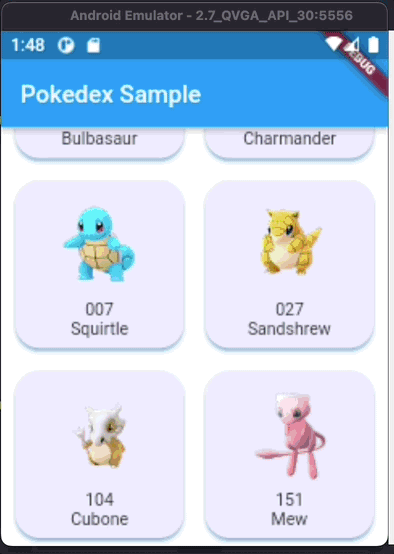
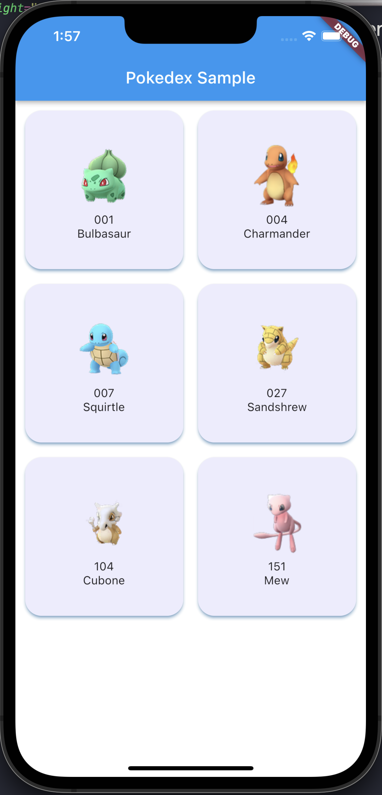
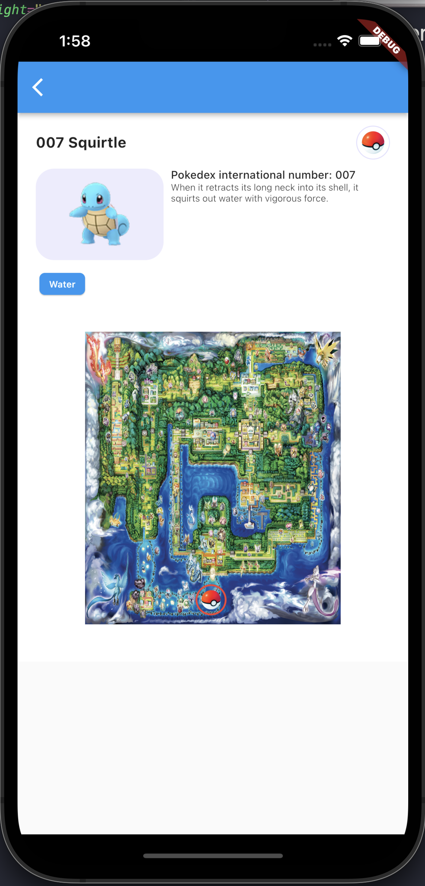
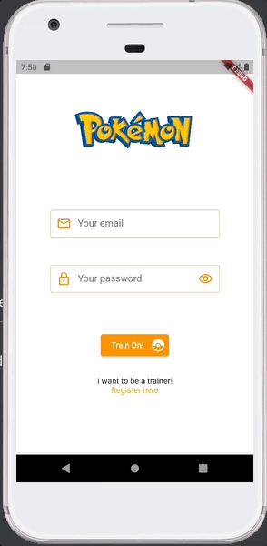

## **Week 1 Homework**
___
## Assignment 3

Running... 
```
flutter doctor
```


## Assignment 4

### *Google Pixel and iPhone 13 Max Pro Screenshot of Recipes App*
___
<br>
 
&nbsp;
&nbsp;
&nbsp;
&nbsp;
&nbsp;
&nbsp;
&nbsp;
&nbsp;
&nbsp;
&nbsp;


## Assignment 6 and Assignment 7

Here it is the Pokedex Sample proyect with some nice to haves.

* Some responsiveness for big and small screens
* Pokeball X,Y location is the same no matter the screen 
* Scrollable on small screens
* Some additional styles to make a more attractive visual experience
<br>
<br>

A 2.7 inch QVGA screen app test



<br>
<br>

Here are some screenshots on an iPhone Max 13 Pro

 
&nbsp;
&nbsp;
&nbsp;
&nbsp;
&nbsp;
&nbsp;
&nbsp;
&nbsp;
&nbsp;
&nbsp;


## **Week 2 Homework**

## Assignment 5
The login page of the pokedex app



<br>
You can find the code here 

[Pokedex](https://github.com/Gugunner/rw-flutter-bootcamp/tree/raul/week-2/week-1/pokedex)