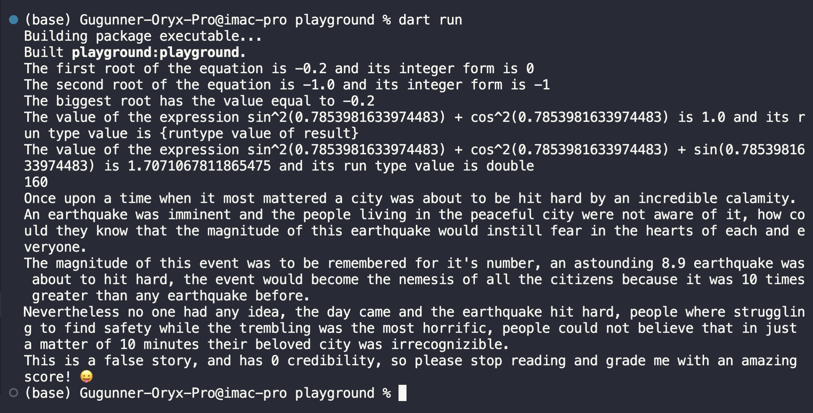
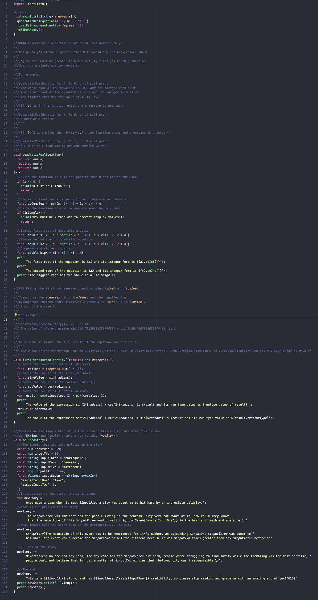

A simple command-line application.

To run execute in console the command from this project root...
```
dart run 
```
## **Week 2 Homework**
## Assignment 1 to 4
This is a screenshot of the code running.
___


<br>
<br>

This is a screenshot of the code itself...(better check it out in the code :sweat_smile:)
___

<br>
<br>

## Assignment 5
The login page of the pokedex app


<br>
You can find the code here 

[Pokedex](https://github.com/Gugunner/rw-flutter-bootcamp/tree/raul/week-2/week-1/pokedex)
